# Alternate Futures Technical Architecture

Comprehensive technical architecture map for the Alternate Futures decentralized cloud platform.

## Table of Contents

1. [System Overview](#system-overview)
2. [Architecture Layers](#architecture-layers)
3. [Core Services](#core-services)
4. [Client Components](#client-components)
5. [Infrastructure](#infrastructure)
6. [Data Flow](#data-flow)
7. [User Flows](#user-flows)
8. [Technology Stack](#technology-stack)
9. [Repository Map](#repository-map)
10. [Security Architecture](#security-architecture)
11. [Deployment Architecture](#deployment-architecture)

---

## System Overview

Alternate Futures is a **decentralized cloud platform** (forked from Fleek) providing IPFS/Filecoin/Arweave hosting, serverless functions, container registry, and AI agent deployment capabilities.

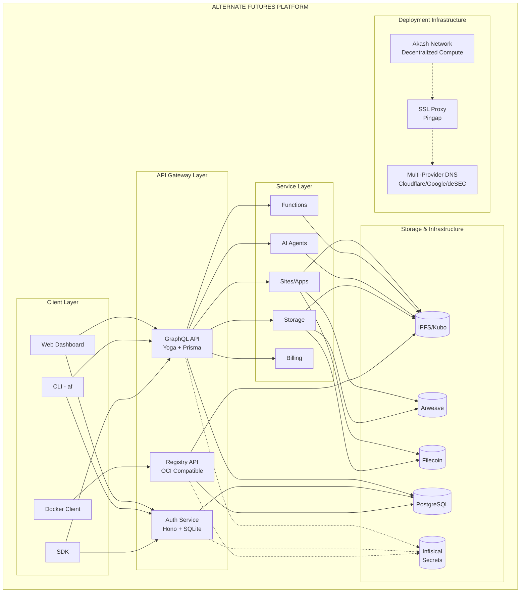
```mermaid
graph TB
    subgraph "ALTERNATE FUTURES PLATFORM"
        subgraph "Client Layer"
            WebDash[Web Dashboard]
            CLI[CLI - af]
            SDK[SDK]
            Docker[Docker Client]
        end
        
        subgraph "API Gateway Layer"
            GraphQL[GraphQL API<br/>Yoga + Prisma]
            Auth[Auth Service<br/>Hono + SQLite]
            Registry[Registry API<br/>OCI Compatible]
        end
        
        subgraph "Service Layer"
            Sites[Sites/Apps]
            Functions[Functions]
            Agents[AI Agents]
            Storage[Storage]
            Billing[Billing]
        end
        
        subgraph "Storage & Infrastructure"
            Postgres[(PostgreSQL)]
            IPFS[(IPFS/Kubo)]
            Arweave[(Arweave)]
            Filecoin[(Filecoin)]
            Secrets[(Infisical<br/>Secrets)]
        end
        
        subgraph "Deployment Infrastructure"
            Akash[Akash Network<br/>Decentralized Compute]
            Proxy[SSL Proxy<br/>Pingap]
            DNS[Multi-Provider DNS<br/>Cloudflare/Google/deSEC]
        end
    end
    
    WebDash --> GraphQL
    CLI --> GraphQL
    SDK --> GraphQL
    Docker --> Registry
    
    WebDash --> Auth
    CLI --> Auth
    SDK --> Auth
    
    GraphQL --> Sites
    GraphQL --> Functions
    GraphQL --> Agents
    GraphQL --> Storage
    GraphQL --> Billing
    
    Sites --> IPFS
    Sites --> Arweave
    Sites --> Filecoin
    Functions --> IPFS
    Agents --> IPFS
    Storage --> IPFS
    Storage --> Arweave
    Storage --> Filecoin
    
    GraphQL --> Postgres
    Auth --> Postgres
    Registry --> Postgres
    Registry --> IPFS
    
    GraphQL -.-> Secrets
    Auth -.-> Secrets
    Registry -.-> Secrets
    
    Proxy -.-> DNS
    Akash -.-> Proxy
```

---

## Architecture Layers

### 1. Client Layer

**Purpose**: User-facing interfaces and tools

| Component | Technology | Repository | Description |
|-----------|-----------|------------|-------------|
| Web Dashboard | Next.js 16 + React 19 | `web-app.alternatefutures.ai` | Main user interface |
| CLI | Node.js (Commander.js) | `package-cloud-cli` | Command-line tool (`af`) |
| SDK | TypeScript | `package-cloud-sdk` | JavaScript SDK for programmatic access |
| Docker Client | OCI Compatible | - | Standard Docker client for registry |

### 2. API Gateway Layer

**Purpose**: Entry points for all client requests

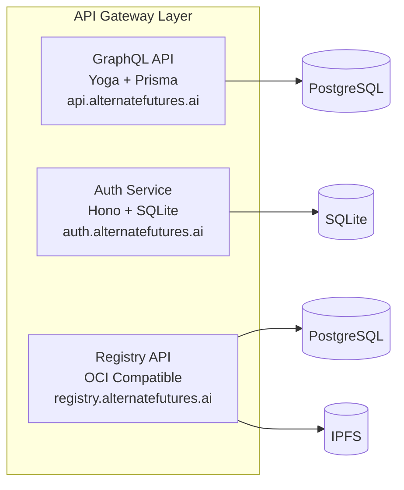
```mermaid
graph LR
    subgraph "API Gateway Layer"
        GraphQL[GraphQL API<br/>Yoga + Prisma<br/>api.alternatefutures.ai]
        Auth[Auth Service<br/>Hono + SQLite<br/>auth.alternatefutures.ai]
        Registry[Registry API<br/>OCI Compatible<br/>registry.alternatefutures.ai]
    end
    
    GraphQL --> DB[(PostgreSQL)]
    Auth --> AuthDB[(SQLite)]
    Registry --> RegDB[(PostgreSQL)]
    Registry --> IPFS[(IPFS)]
```

### 3. Service Layer

**Purpose**: Core business logic and functionality

| Service | Purpose | Technology | Repository |
|---------|---------|-----------|------------|
| Sites/Apps | Static site & app hosting | IPFS/Arweave/Filecoin | `service-cloud-api` |
| Functions | Serverless edge functions with Node.js runtime, Web APIs, SGX support | Runtime containers + IPFS | `service-cloud-api` |
| Agents | AI agent deployment | Container orchestration | `service-cloud-api` |
| Storage | Decentralized file storage | IPFS/Arweave/Filecoin | `service-cloud-api` |
| Billing | Payment processing | Stripe | `service-cloud-api` |
| Registry | Container image storage | IPFS + PostgreSQL | Separate stack |

### 4. Storage & Data Layer

**Purpose**: Persistent data storage

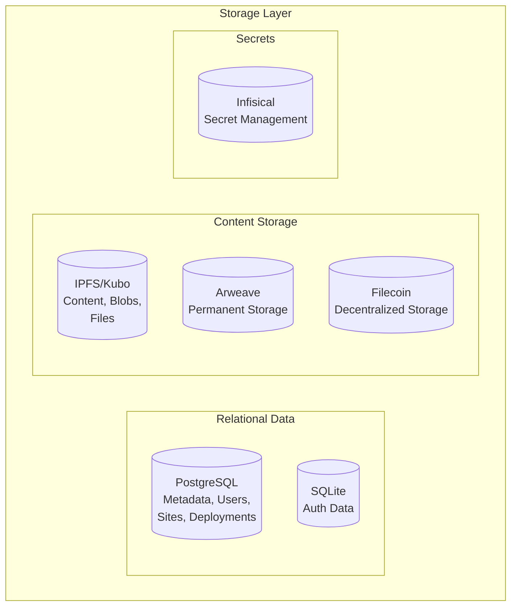
```mermaid
graph TB
    subgraph "Storage Layer"
        subgraph "Relational Data"
            PG[(PostgreSQL<br/>Metadata, Users,<br/>Sites, Deployments)]
            SQLite[(SQLite<br/>Auth Data)]
        end
        
        subgraph "Content Storage"
            IPFS[(IPFS/Kubo<br/>Content, Blobs,<br/>Files)]
            Arweave[(Arweave<br/>Permanent Storage)]
            Filecoin[(Filecoin<br/>Decentralized Storage)]
        end
        
        subgraph "Secrets"
            Infisical[(Infisical<br/>Secret Management)]
        end
    end
```

### 5. Infrastructure Layer

**Purpose**: Deployment and network infrastructure

- **Akash Network**: Decentralized compute platform hosting all services
- **SSL Proxy (Pingap)**: SSL termination and traffic routing
- **DNS**: Multi-provider DNS (Cloudflare, Google, deSEC)
- **Monitoring**: Observability and health checks

---

## Core Services

### 1. GraphQL API (`service-cloud-api`)

**Repository**: `alternatefutures/service-cloud-api`

**Technology Stack**:
- GraphQL Yoga (GraphQL server)
- Prisma (ORM)
- PostgreSQL (database)
- Node.js/TypeScript

**Responsibilities**:
- User management
- Project management
- Site/deployment management
- IPFS/Arweave/Filecoin integration
- Billing (Stripe)
- API key management
- Function management
- Agent deployment

**Endpoints**:
- `https://api.alternatefutures.ai/graphql`

**Key Features**:
- Depth limiting
- Complexity analysis
- Rate limiting
- JWT authentication
- Personal Access Tokens

### 2. Auth Service (`service-auth`)

**Repository**: `alternatefutures/service-auth`

**Technology Stack**:
- Hono (HTTP framework)
- SQLite (database)
- Node.js/TypeScript

**Authentication Methods**:
1. Email magic links (passwordless)
2. SMS OTP
3. Web3 wallets (SIWE - Sign-In with Ethereum)
   - MetaMask
   - WalletConnect
   - Phantom
4. Social OAuth
   - Google
   - GitHub
   - Twitter
   - Discord
5. Account linking (multiple methods per user)

**Endpoints**:
- `https://auth.alternatefutures.ai`

### 3. Container Registry

**Technology Stack**:
- OpenRegistry (OCI-compliant API)
- IPFS/Kubo (blob storage)
- PostgreSQL (metadata)

**Architecture**:

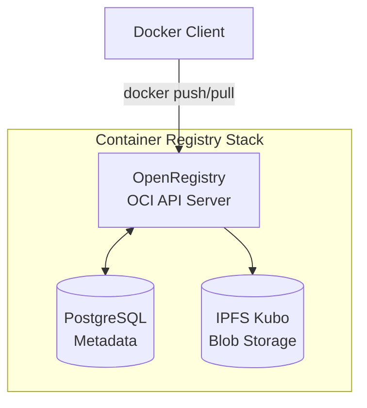
```mermaid
graph TB
    subgraph "Container Registry Stack"
        OpenReg[OpenRegistry<br/>OCI API Server]
        RegDB[(PostgreSQL<br/>Metadata)]
        RegIPFS[(IPFS Kubo<br/>Blob Storage)]
    end
    
    OpenReg <--> RegDB
    OpenReg --> RegIPFS
    
    Docker[Docker Client] -->|docker push/pull| OpenReg
```

**Features**:
- OCI-compliant (Docker compatible)
- Content-addressed storage (IPFS)
- Layer deduplication
- Authentication via JWT
- TLS/HTTPS

**Endpoints**:
- `https://registry.alternatefutures.ai`

See [Registry Architecture Documentation](https://github.com/alternatefutures/web-docs.alternatefutures.ai/blob/main/docs/guides/registry-architecture.md) for detailed information.

### 4. Functions Service (Cloud Functions)

**Repository**: `alternatefutures/service-cloud-api`

**Technology Stack**:
- Node.js-compatible runtime
- IPFS (code storage)
- RuntimeRouter (request handling & routing)
- Optional SGX (Software Guard Extensions)

**Capabilities**:
- **Serverless Edge Execution**: Functions run on the edge, close to users
- **Web Standard APIs**: Full support for `fetch`, `Request`, `Response`, and other Web APIs
- **Node.js Compatibility**: Node.js-compatible runtime environment
- **Route Configuration**: Flexible route patterns (`/api/*`, `/users/:id`, etc.)
- **Automatic Scaling**: Scales based on demand
- **SGX Support**: Optional encrypted execution for confidential computing
- **IPFS Code Storage**: Function code stored and retrieved from IPFS via CID
- **Custom Domains**: Mount functions on custom domains or use default URLs

**Function Runtime Features**:
- API endpoints creation without managing servers
- Dynamic content generation
- Data processing and transformation
- Webhook handling
- Form processing
- Authentication middleware
- Image processing
- Cross-origin request support (CORS)

**URLs**:
- Default: `https://<function-slug>.af-functions.app`
- Custom domains supported

**Management**:
- CLI: `af functions create`, `af functions deploy`
- SDK: Full programmatic API via `@alternatefutures/sdk`
- Web Dashboard: Visual function management

**Architecture**:

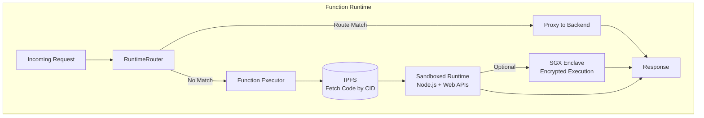
```mermaid
graph TB
    subgraph "Function Runtime"
        Request[Incoming Request] --> Router[RuntimeRouter]
        Router -->|Route Match| Proxy[Proxy to Backend]
        Router -->|No Match| Executor[Function Executor]
        
        Executor --> IPFS[(IPFS<br/>Fetch Code by CID)]
        IPFS --> Runtime[Sandboxed Runtime<br/>Node.js + Web APIs]
        Runtime -->|Optional| SGX[SGX Enclave<br/>Encrypted Execution]
        
        Runtime --> Response[Response]
        Proxy --> Response
        SGX --> Response
    end
```

**Security**:
- Environment variable support for secrets
- SGX for encrypted execution and attestation
- Code integrity verification via BLAKE3 hash

See [Functions Documentation](https://github.com/alternatefutures/web-docs.alternatefutures.ai/blob/main/docs/guides/functions.md) for detailed usage guide.

### 5. Secrets Management (`service-secrets`)

**Repository**: `alternatefutures/service-secrets`

**Technology**: Infisical (self-hosted)

**Purpose**: Centralized secrets management for all services

**Architecture Decision**: Runs outside the SSL proxy for resilience - if proxy has issues, Infisical remains accessible.

**Endpoints**:
- `https://secrets.alternatefutures.ai`

### 6. Proxy Service (`infrastructure-proxy`)

**Repository**: `alternatefutures/infrastructure-proxy`

**Technology**: Pingap (based on Pingora)

**Purpose**:
- SSL termination
- Traffic routing
- Load balancing
- Let's Encrypt DNS-01 via Cloudflare

**Deployment**:
- Dedicated IP: 170.75.255.101
- DSEQ: 24758214
- Provider: leet.haus

**Routes**:
- auth.alternatefutures.ai → Auth Service
- api.alternatefutures.ai → GraphQL API
- app.alternatefutures.ai → Web Dashboard
- docs.alternatefutures.ai → Documentation
- alternatefutures.ai → Company Website
- registry.alternatefutures.ai → Container Registry

### 7. DNS Management (`infrastructure-dns`)

**Repository**: `alternatefutures/infrastructure-dns`

**Technology**: OctoDNS

**Providers**:
- Cloudflare (primary)
- Google Cloud DNS
- deSEC

**Features**:
- Multi-provider sync
- Automatic failover monitoring
- Version control for DNS records

---

## Client Components

### 1. Web Dashboard

**Repository**: `alternatefutures/web-app.alternatefutures.ai`

**Technology**:
- Next.js 16.0 (with Turbopack)
- React 19.1
- Radix UI (component library)
- Tailwind CSS 4
- TypeScript 5
- next-intl (internationalization)
- next-themes (theming support)
- Lucide React (icons)
- @xyflow/react (flow diagrams)
- react-tracked (state management)

**Features**:
- Project management
- Site deployment
- Function management
- Agent deployment
- API key management
- Billing dashboard
- Real-time deployment logs
- Multi-language support
- Dark/light theme support
- Visual workflow editor

**URL**: `https://app.alternatefutures.ai`

### 2. CLI Tool

**Repository**: `alternatefutures/package-cloud-cli`

**Binary Name**: `af`

**Technology**: Node.js + Commander.js

**Features**:
- Site deployment (`af deploy`)
- Site management (`af sites list`)
- Function deployment
- Agent deployment
- Authentication
- Configuration management

**Installation**:
```bash
npm install -g @alternatefutures/cli
```

### 3. SDK

**Repository**: `alternatefutures/package-cloud-sdk`

**Technology**: TypeScript (browser + Node.js)

**Features**:
- Programmatic API access
- Site deployment
- File upload to IPFS/Arweave
- Project management
- TypeScript support

**Installation**:
```bash
npm install @alternatefutures/sdk
```

### 4. Documentation Site

**Repository**: `alternatefutures/web-docs.alternatefutures.ai`

**Technology**: VitePress

**Content**:
- Guides
- API reference
- CLI reference
- SDK reference
- Architecture documentation

**URL**: `https://docs.alternatefutures.ai`

### 5. Company Website

**Repository**: `alternatefutures/web-alternatefutures.ai`

**Technology**: Astro

**Purpose**: Marketing and company information

**URL**: `https://alternatefutures.ai`

---

## Infrastructure

### Akash Network Deployments

All services run on **Akash Network**, a decentralized compute marketplace.

| Service | DSEQ | Provider | Ingress/IP | Resources |
|---------|------|----------|------------|-----------|
| SSL Proxy | 24758214 | leet.haus | 170.75.255.101 (dedicated) | 2 CPU, 4GB RAM |
| Secrets (Infisical) | 24672527 | Europlots | ddchr1pel5e0p8i0c46drjpclg.ingress.europlots.com | 2 CPU, 4GB RAM, 20GB storage |

**Deployment Management**:
- Repository: `alternatefutures/admin`
- File: `infrastructure/deployments.ts`
- Tool: Akash MCP Server (for Claude Code integration)

### Traffic Flow

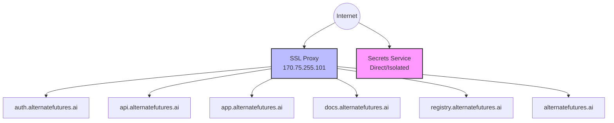
```mermaid
graph TB
    Internet((Internet))
    
    Internet --> Proxy[SSL Proxy<br/>170.75.255.101]
    Internet --> Secrets[Secrets Service<br/>Direct/Isolated]
    
    Proxy --> Auth[auth.alternatefutures.ai]
    Proxy --> API[api.alternatefutures.ai]
    Proxy --> App[app.alternatefutures.ai]
    Proxy --> Docs[docs.alternatefutures.ai]
    Proxy --> Reg[registry.alternatefutures.ai]
    Proxy --> Web[alternatefutures.ai]
    
    style Secrets fill:#f9f,stroke:#333,stroke-width:2px
    style Proxy fill:#bbf,stroke:#333,stroke-width:2px
```

### DNS Architecture

Multi-provider setup for redundancy:

1. **Cloudflare** (primary)
   - SSL/TLS proxy
   - DDoS protection
   - DNS-01 challenge for Let's Encrypt

2. **Google Cloud DNS** (secondary)
   - Failover support

3. **deSEC** (secondary)
   - Decentralized DNS option

**Management**: OctoDNS with automatic sync across providers

---

## Data Flow

### Site Deployment Flow

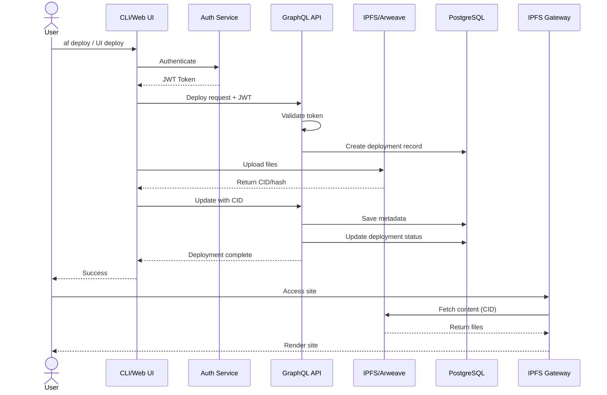
```mermaid
sequenceDiagram
    actor User
    participant CLI as CLI/Web UI
    participant Auth as Auth Service
    participant API as GraphQL API
    participant Storage as IPFS/Arweave
    participant DB as PostgreSQL
    participant Gateway as IPFS Gateway
    
    User->>CLI: af deploy / UI deploy
    CLI->>Auth: Authenticate
    Auth-->>CLI: JWT Token
    
    CLI->>API: Deploy request + JWT
    API->>API: Validate token
    API->>DB: Create deployment record
    
    CLI->>Storage: Upload files
    Storage-->>CLI: Return CID/hash
    
    CLI->>API: Update with CID
    API->>DB: Save metadata
    API->>DB: Update deployment status
    
    API-->>CLI: Deployment complete
    CLI-->>User: Success
    
    User->>Gateway: Access site
    Gateway->>Storage: Fetch content (CID)
    Storage-->>Gateway: Return files
    Gateway-->>User: Render site
```

### Registry Push Flow

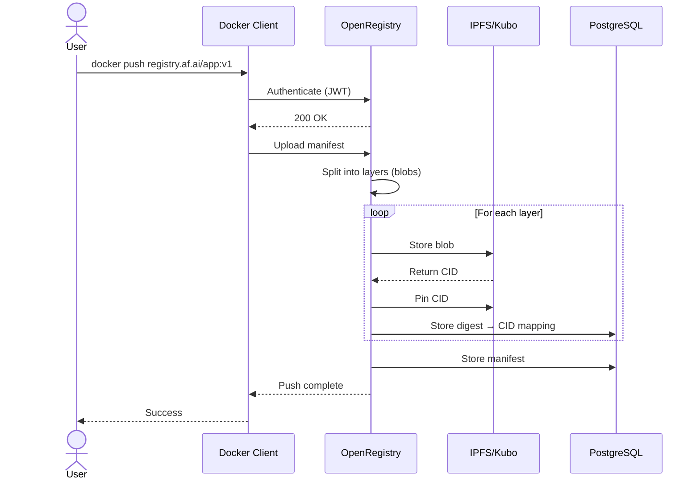
```mermaid
sequenceDiagram
    actor User
    participant Docker as Docker Client
    participant Reg as OpenRegistry
    participant IPFS as IPFS/Kubo
    participant DB as PostgreSQL
    
    User->>Docker: docker push registry.af.ai/app:v1
    Docker->>Reg: Authenticate (JWT)
    Reg-->>Docker: 200 OK
    
    Docker->>Reg: Upload manifest
    Reg->>Reg: Split into layers (blobs)
    
    loop For each layer
        Reg->>IPFS: Store blob
        IPFS-->>Reg: Return CID
        Reg->>IPFS: Pin CID
        Reg->>DB: Store digest → CID mapping
    end
    
    Reg->>DB: Store manifest
    Reg-->>Docker: Push complete
    Docker-->>User: Success
```

### Authentication Flow

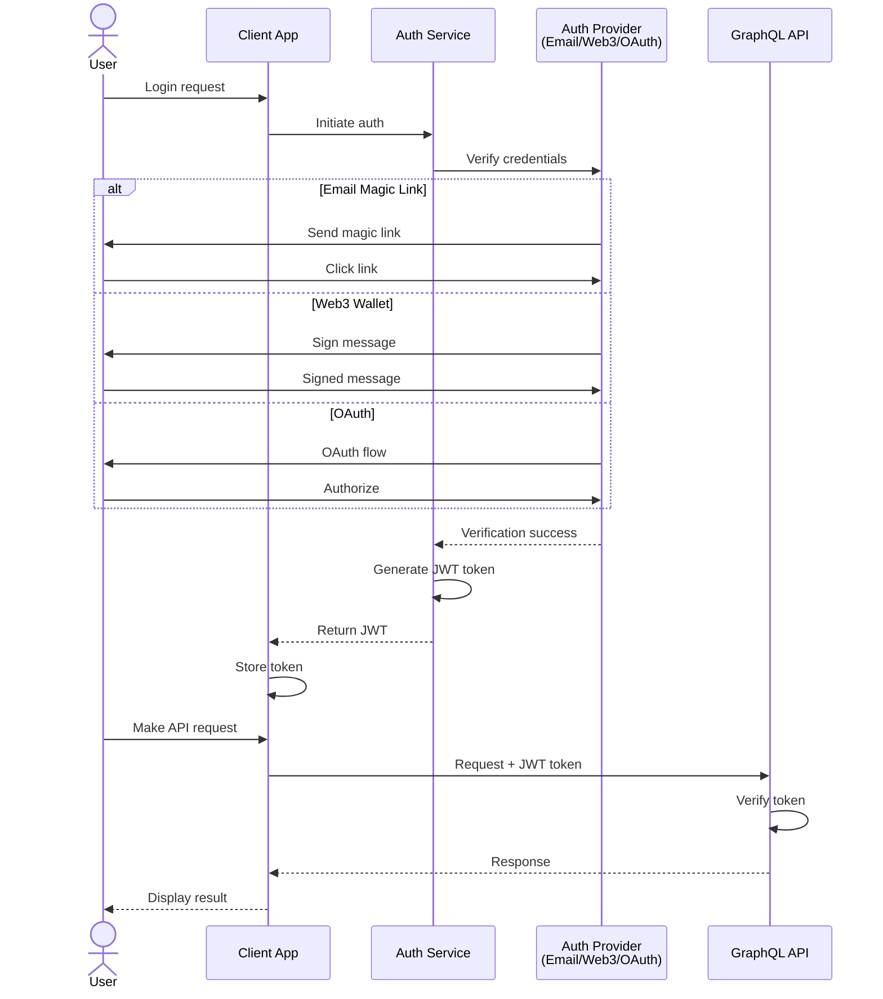
```mermaid
sequenceDiagram
    actor User
    participant Client as Client App
    participant Auth as Auth Service
    participant Provider as Auth Provider<br/>(Email/Web3/OAuth)
    participant API as GraphQL API
    
    User->>Client: Login request
    Client->>Auth: Initiate auth
    Auth->>Provider: Verify credentials
    
    alt Email Magic Link
        Provider->>User: Send magic link
        User->>Provider: Click link
    else Web3 Wallet
        Provider->>User: Sign message
        User->>Provider: Signed message
    else OAuth
        Provider->>User: OAuth flow
        User->>Provider: Authorize
    end
    
    Provider-->>Auth: Verification success
    Auth->>Auth: Generate JWT token
    Auth-->>Client: Return JWT
    
    Client->>Client: Store token
    
    User->>Client: Make API request
    Client->>API: Request + JWT token
    API->>API: Verify token
    API-->>Client: Response
    Client-->>User: Display result
```

---

## User Flows

This section outlines the complete user journey for common platform tasks, from initial onboarding to deploying sites, functions, containers, and AI agents.

### 1. User Onboarding and Authentication

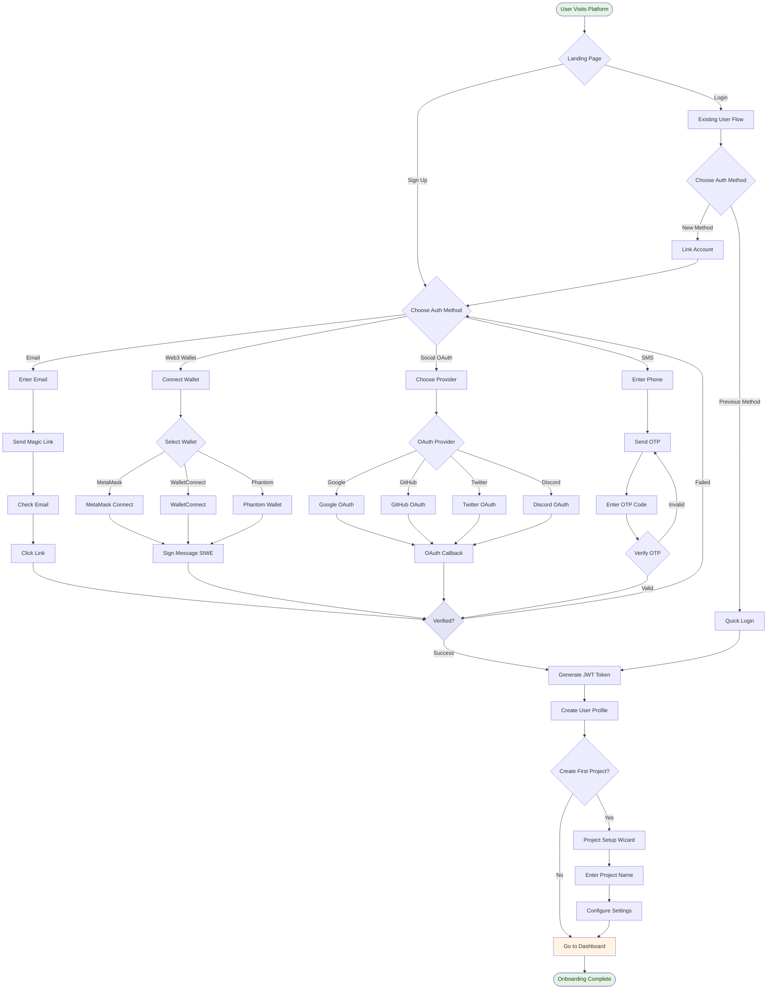
```mermaid
flowchart TD
    Start([User Visits Platform]) --> Landing{Landing Page}
    Landing -->|Sign Up| ChooseAuth{Choose Auth Method}
    Landing -->|Login| ExistingUser[Existing User Flow]
    
    ChooseAuth -->|Email| EmailAuth[Enter Email]
    ChooseAuth -->|Web3 Wallet| Web3Auth[Connect Wallet]
    ChooseAuth -->|Social OAuth| SocialAuth[Choose Provider]
    ChooseAuth -->|SMS| SMSAuth[Enter Phone]
    
    EmailAuth --> SendMagicLink[Send Magic Link]
    SendMagicLink --> CheckEmail[Check Email]
    CheckEmail --> ClickLink[Click Link]
    ClickLink --> Verified{Verified?}
    
    Web3Auth --> SelectWallet{Select Wallet}
    SelectWallet -->|MetaMask| MetaMask[MetaMask Connect]
    SelectWallet -->|WalletConnect| WalletConnect[WalletConnect]
    SelectWallet -->|Phantom| Phantom[Phantom Wallet]
    MetaMask --> SignMessage[Sign Message SIWE]
    WalletConnect --> SignMessage
    Phantom --> SignMessage
    SignMessage --> Verified
    
    SocialAuth --> OAuthFlow{OAuth Provider}
    OAuthFlow -->|Google| Google[Google OAuth]
    OAuthFlow -->|GitHub| GitHub[GitHub OAuth]
    OAuthFlow -->|Twitter| Twitter[Twitter OAuth]
    OAuthFlow -->|Discord| Discord[Discord OAuth]
    Google --> OAuthCallback[OAuth Callback]
    GitHub --> OAuthCallback
    Twitter --> OAuthCallback
    Discord --> OAuthCallback
    OAuthCallback --> Verified
    
    SMSAuth --> SendOTP[Send OTP]
    SendOTP --> EnterOTP[Enter OTP Code]
    EnterOTP --> VerifyOTP{Verify OTP}
    VerifyOTP -->|Valid| Verified
    VerifyOTP -->|Invalid| SendOTP
    
    Verified -->|Success| GenerateJWT[Generate JWT Token]
    Verified -->|Failed| ChooseAuth
    
    GenerateJWT --> CreateProfile[Create User Profile]
    CreateProfile --> SetupProject{Create First Project?}
    
    SetupProject -->|Yes| ProjectSetup[Project Setup Wizard]
    SetupProject -->|No| Dashboard[Go to Dashboard]
    
    ProjectSetup --> ProjectName[Enter Project Name]
    ProjectName --> ProjectSettings[Configure Settings]
    ProjectSettings --> Dashboard
    
    Dashboard --> OnboardingComplete([Onboarding Complete])
    
    ExistingUser --> LoginAuth{Choose Auth Method}
    LoginAuth -->|Previous Method| QuickLogin[Quick Login]
    LoginAuth -->|New Method| LinkAccount[Link Account]
    QuickLogin --> GenerateJWT
    LinkAccount --> ChooseAuth
    
    style Start fill:#e1f5e1
    style OnboardingComplete fill:#e1f5e1
    style Dashboard fill:#fff4e1
    style Verified fill:#e1e5f5
```

**Key Steps**:
1. User visits platform and chooses to sign up or login
2. Multiple authentication options available (email, Web3, OAuth, SMS)
3. Verification process specific to chosen method
4. JWT token generation upon successful authentication
5. Optional first project setup
6. Access to dashboard

### 2. Site Deployment User Journey


```mermaid
flowchart TD
    Start([User Wants to Deploy Site]) --> ChooseMethod{Choose Method}
    
    ChooseMethod -->|Web UI| WebUI[Open Web Dashboard]
    ChooseMethod -->|CLI| CLI[Use CLI Tool]
    ChooseMethod -->|SDK| SDK[Use SDK Code]
    
    WebUI --> WebLogin{Authenticated?}
    WebLogin -->|No| WebAuth[Login to Dashboard]
    WebLogin -->|Yes| WebDashboard[Navigate to Sites]
    WebAuth --> WebDashboard
    
    CLI --> CLILogin{Authenticated?}
    CLILogin -->|No| CLIAuth[af login]
    CLILogin -->|Yes| CLIReady[CLI Ready]
    CLIAuth --> CLIReady
    
    SDK --> SDKAuth[Initialize with API Key]
    SDKAuth --> SDKReady[SDK Ready]
    
    WebDashboard --> WebNewSite[Click New Site]
    WebNewSite --> WebUpload{Upload Method}
    WebUpload -->|File Upload| WebSelectFiles[Select Files/Folder]
    WebUpload -->|Git Repo| WebConnectGit[Connect Git Repository]
    WebUpload -->|Template| WebSelectTemplate[Choose Template]
    
    CLIReady --> CLINavigate[Navigate to Project]
    CLINavigate --> CLICommand[Run: af deploy]
    CLICommand --> CLIDetect[Detect Framework]
    
    SDKReady --> SDKCode[Write Deployment Code]
    SDKCode --> SDKExecute[Execute Deploy]
    
    WebSelectFiles --> WebConfigure[Configure Settings]
    WebConnectGit --> WebConfigure
    WebSelectTemplate --> WebConfigure
    CLIDetect --> Configure[Configure Deployment]
    SDKExecute --> Configure
    
    WebConfigure --> Configure
    
    Configure --> BuildSettings[Build Settings]
    BuildSettings --> Framework{Framework Detected?}
    Framework -->|Yes| AutoConfig[Auto-Configure Build]
    Framework -->|No| ManualConfig[Manual Configuration]
    AutoConfig --> ChooseStorage
    ManualConfig --> ChooseStorage
    
    ChooseStorage{Choose Storage}
    ChooseStorage -->|IPFS| IPFSSettings[IPFS Settings]
    ChooseStorage -->|Arweave| ArweaveSettings[Arweave Settings]
    ChooseStorage -->|Filecoin| FilecoinSettings[Filecoin Settings]
    
    IPFSSettings --> DomainSetup
    ArweaveSettings --> DomainSetup
    FilecoinSettings --> DomainSetup
    
    DomainSetup{Domain Setup}
    DomainSetup -->|Custom| CustomDomain[Add Custom Domain]
    DomainSetup -->|Subdomain| AFSubdomain[Use AF Subdomain]
    DomainSetup -->|Default| DefaultURL[Use Default URL]
    
    CustomDomain --> BuildStart
    AFSubdomain --> BuildStart
    DefaultURL --> BuildStart
    
    BuildStart[Start Build Process]
    BuildStart --> BuildEnv[Load Environment Variables]
    BuildEnv --> BuildExecute[Execute Build Command]
    BuildExecute --> BuildSuccess{Build Success?}
    
    BuildSuccess -->|No| BuildError[Show Build Errors]
    BuildError --> FixBuild{Fix Build?}
    FixBuild -->|Yes| BuildSettings
    FixBuild -->|No| Cancelled([Deployment Cancelled])
    
    BuildSuccess -->|Yes| Upload[Upload to Storage]
    Upload --> ProcessFiles[Process Files]
    ProcessFiles --> GenerateCID[Generate CID/Hash]
    GenerateCID --> PinContent[Pin Content]
    PinContent --> UpdateDB[Update Database]
    UpdateDB --> ConfigureGateway[Configure Gateway]
    ConfigureGateway --> DNSSetup{Custom Domain?}
    
    DNSSetup -->|Yes| DNSConfig[Configure DNS]
    DNSSetup -->|No| Complete
    DNSConfig --> SSLCert[Issue SSL Certificate]
    SSLCert --> Complete
    
    Complete[Deployment Complete]
    Complete --> GetURL[Get Deployment URL]
    GetURL --> NotifyUser[Notify User]
    NotifyUser --> Preview{Preview Site?}
    
    Preview -->|Yes| OpenSite[Open Site in Browser]
    Preview -->|No| Dashboard[View in Dashboard]
    OpenSite --> Monitor
    Dashboard --> Monitor
    
    Monitor[Monitor Deployment]
    Monitor --> Analytics[View Analytics]
    Analytics --> ManageOps{Manage?}
    
    ManageOps -->|Update| Update[Deploy Update]
    ManageOps -->|Rollback| Rollback[Rollback Version]
    ManageOps -->|Delete| Delete[Delete Site]
    ManageOps -->|Done| End([Site Deployed])
    
    Update --> BuildStart
    Rollback --> Complete
    Delete --> End
    
    style Start fill:#e1f5e1
    style End fill:#e1f5e1
    style Cancelled fill:#ffe1e1
    style Complete fill:#e1e5f5
    style BuildError fill:#ffe1e1
```

**Key Steps**:
1. Choose deployment method (Web UI, CLI, or SDK)
2. Authenticate and access deployment interface
3. Configure build settings and framework detection
4. Select storage backend (IPFS/Arweave/Filecoin)
5. Set up domain (custom, subdomain, or default)
6. Build and upload process
7. Generate CID and pin content
8. Configure gateway and DNS
9. Monitor and manage deployment

### 3. Function Deployment Flow


```mermaid
flowchart TD
    Start([Deploy Serverless Function]) --> ChooseInterface{Choose Interface}
    
    ChooseInterface -->|CLI| CLIFlow[CLI Workflow]
    ChooseInterface -->|Web UI| WebFlow[Web Dashboard]
    ChooseInterface -->|SDK| SDKFlow[SDK Integration]
    
    CLIFlow --> CLIAuth{Authenticated?}
    CLIAuth -->|No| CLILogin[af login]
    CLIAuth -->|Yes| CLICreate
    CLILogin --> CLICreate[af functions create]
    
    WebFlow --> WebAuth{Authenticated?}
    WebAuth -->|No| WebLogin[Login to Dashboard]
    WebAuth -->|Yes| WebNav
    WebLogin --> WebNav[Navigate to Functions]
    WebNav --> WebNew[Click New Function]
    
    SDKFlow --> SDKInit[Initialize SDK]
    SDKInit --> SDKCreate[Create Function Code]
    
    CLICreate --> FunctionName[Enter Function Name]
    WebNew --> FunctionName
    SDKCreate --> FunctionName
    
    FunctionName --> Runtime{Choose Runtime}
    Runtime -->|Node.js| NodeRuntime[Node.js Runtime]
    Runtime -->|Web APIs| WebRuntime[Web Standards]
    
    NodeRuntime --> CodeSource
    WebRuntime --> CodeSource
    
    CodeSource{Code Source}
    CodeSource -->|Write Inline| InlineEditor[Inline Code Editor]
    CodeSource -->|Upload File| UploadCode[Upload Function File]
    CodeSource -->|Git Repo| GitRepo[Connect Repository]
    CodeSource -->|Template| UseTemplate[Select Template]
    
    InlineEditor --> WriteCode[Write Function Code]
    UploadCode --> CodeReady
    GitRepo --> SelectBranch[Select Branch/Path]
    UseTemplate --> CodeReady
    
    WriteCode --> CodeReady[Code Ready]
    SelectBranch --> CodeReady
    
    CodeReady --> RouteConfig[Configure Routes]
    RouteConfig --> RoutePattern{Route Pattern}
    RoutePattern -->|Path| PathRoute["e.g., /api/*"]
    RoutePattern -->|Exact| ExactRoute["e.g., /users/:id"]
    RoutePattern -->|Wildcard| WildcardRoute["e.g., /*"]
    
    PathRoute --> EnvVars
    ExactRoute --> EnvVars
    WildcardRoute --> EnvVars
    
    EnvVars[Environment Variables]
    EnvVars --> AddSecrets{Add Secrets?}
    AddSecrets -->|Yes| SecretManager[Select from Secrets]
    AddSecrets -->|No| SecurityOptions
    SecretManager --> SecurityOptions
    
    SecurityOptions{Security Features}
    SecurityOptions -->|SGX| EnableSGX[Enable SGX Enclave]
    SecurityOptions -->|Standard| StandardSec[Standard Security]
    
    EnableSGX --> DomainConfig
    StandardSec --> DomainConfig
    
    DomainConfig{Domain Configuration}
    DomainConfig -->|Default| DefaultDomain[Use *.af-functions.app]
    DomainConfig -->|Custom| CustomDomain[Add Custom Domain]
    
    DefaultDomain --> ValidateCode
    CustomDomain --> DNSVerify[Verify DNS]
    DNSVerify --> ValidateCode
    
    ValidateCode[Validate Function Code]
    ValidateCode --> CodeCheck{Valid?}
    CodeCheck -->|No| ShowErrors[Show Validation Errors]
    ShowErrors --> FixCode{Fix Code?}
    FixCode -->|Yes| CodeSource
    FixCode -->|No| CancelDeploy([Deployment Cancelled])
    
    CodeCheck -->|Yes| PackageFunction[Package Function]
    PackageFunction --> HashCode[Generate BLAKE3 Hash]
    HashCode --> UploadIPFS[Upload to IPFS]
    UploadIPFS --> GetCID[Get CID]
    GetCID --> RegisterFunc[Register in Database]
    RegisterFunc --> ConfigRouter[Configure RuntimeRouter]
    
    ConfigRouter --> DeployRuntime[Deploy Runtime]
    DeployRuntime --> HealthCheck{Health Check}
    HealthCheck -->|Failed| DeployError[Deployment Error]
    HealthCheck -->|Success| FunctionLive[Function Live]
    
    DeployError --> Retry{Retry?}
    Retry -->|Yes| DeployRuntime
    Retry -->|No| CancelDeploy
    
    FunctionLive --> GetURL[Get Function URL]
    GetURL --> TestFunction{Test Function?}
    
    TestFunction -->|Yes| SendRequest[Send Test Request]
    SendRequest --> ViewResponse[View Response]
    ViewResponse --> TestResult{Works?}
    TestResult -->|No| Debug[Debug Function]
    TestResult -->|Yes| MonitorFunc
    Debug --> ViewLogs[View Function Logs]
    ViewLogs --> FixCode
    
    TestFunction -->|No| MonitorFunc
    
    MonitorFunc[Monitor Function]
    MonitorFunc --> Metrics[View Metrics]
    Metrics --> MetricsData{Metrics}
    MetricsData --> Invocations[Invocations Count]
    MetricsData --> Latency[Response Time]
    MetricsData --> Errors[Error Rate]
    MetricsData --> Traffic[Traffic Patterns]
    
    Invocations --> Management
    Latency --> Management
    Errors --> Management
    Traffic --> Management
    
    Management{Function Management}
    Management -->|Update| UpdateFunc[Update Function Code]
    Management -->|Scale| ScaleFunc[Adjust Resources]
    Management -->|Delete| DeleteFunc[Delete Function]
    Management -->|Done| End([Function Deployed])
    
    UpdateFunc --> CodeSource
    ScaleFunc --> MonitorFunc
    DeleteFunc --> End
    
    style Start fill:#e1f5e1
    style End fill:#e1f5e1
    style CancelDeploy fill:#ffe1e1
    style FunctionLive fill:#e1e5f5
    style DeployError fill:#ffe1e1
```

**Key Steps**:
1. Choose deployment interface (CLI, Web UI, or SDK)
2. Create new function with name and runtime
3. Provide function code (inline, upload, Git, or template)
4. Configure routes and patterns
5. Set environment variables and secrets
6. Enable security features (optional SGX)
7. Configure domain (default or custom)
8. Validate and package function
9. Upload to IPFS and get CID
10. Deploy runtime and health check
11. Test function and view metrics
12. Monitor and manage function

### 4. Container Registry User Flow


```mermaid
flowchart TD
    Start([Use Container Registry]) --> Purpose{Purpose}
    
    Purpose -->|Push Image| PushFlow[Push Workflow]
    Purpose -->|Pull Image| PullFlow[Pull Workflow]
    Purpose -->|Manage| ManageFlow[Manage Repositories]
    
    PushFlow --> DockerInstalled{Docker Installed?}
    DockerInstalled -->|No| InstallDocker[Install Docker]
    DockerInstalled -->|Yes| AuthRegistry
    InstallDocker --> AuthRegistry
    
    AuthRegistry[Authenticate to Registry]
    AuthRegistry --> GetCreds{Get Credentials}
    GetCreds -->|CLI| CLIToken[af registry login]
    GetCreds -->|Dashboard| WebToken[Generate Token in Dashboard]
    GetCreds -->|API Key| UseAPIKey[Use Personal Access Token]
    
    CLIToken --> DockerLogin
    WebToken --> DockerLogin
    UseAPIKey --> DockerLogin
    
    DockerLogin[docker login registry.af.ai]
    DockerLogin --> LoginSuccess{Success?}
    LoginSuccess -->|No| AuthError[Authentication Error]
    LoginSuccess -->|Yes| BuildImage
    
    AuthError --> CheckCreds[Check Credentials]
    CheckCreds --> GetCreds
    
    BuildImage[Build Container Image]
    BuildImage --> Dockerfile{Have Dockerfile?}
    Dockerfile -->|No| CreateDockerfile[Create Dockerfile]
    Dockerfile -->|Yes| DockerBuild
    
    CreateDockerfile --> DockerBuild[docker build -t app:v1 .]
    DockerBuild --> BuildSuccess{Build Success?}
    BuildSuccess -->|No| BuildFailed[Build Failed]
    BuildSuccess -->|Yes| TagImage
    
    BuildFailed --> FixDockerfile[Fix Dockerfile]
    FixDockerfile --> DockerBuild
    
    TagImage[Tag Image]
    TagImage --> TagFormat[docker tag app:v1<br/>registry.af.ai/user/app:v1]
    TagFormat --> PushImage[Push to Registry]
    
    PushImage --> DockerPush[docker push<br/>registry.af.ai/user/app:v1]
    DockerPush --> ProcessPush[Registry Processes Push]
    ProcessPush --> SplitLayers[Split into Layers]
    SplitLayers --> UploadLayers[Upload Layers to IPFS]
    
    UploadLayers --> LayerLoop{For Each Layer}
    LayerLoop --> StoreCID[Store CID in IPFS]
    StoreCID --> PinLayer[Pin Layer]
    PinLayer --> SaveMapping[Save Digest→CID Mapping]
    SaveMapping --> NextLayer{More Layers?}
    NextLayer -->|Yes| LayerLoop
    NextLayer -->|No| SaveManifest
    
    SaveManifest[Save Manifest to DB]
    SaveManifest --> Dedupe[Deduplicate Layers]
    Dedupe --> PushComplete[Push Complete]
    
    PushComplete --> Verify{Verify Upload?}
    Verify -->|Yes| CheckRegistry[Check in Dashboard]
    Verify -->|No| PushDone
    CheckRegistry --> PushDone[Push Successful]
    
    PushDone --> UseImage{Use Image?}
    UseImage -->|Deploy| DeployImage[Deploy Container]
    UseImage -->|Share| ShareImage[Share Repository]
    UseImage -->|Later| EndPush([Image Pushed])
    
    DeployImage --> AgentDeploy[Deploy as Agent]
    ShareImage --> AccessControl[Configure Access]
    
    PullFlow --> PullAuth{Authenticated?}
    PullAuth -->|No| DockerLogin
    PullAuth -->|Yes| PullCommand
    
    PullCommand[docker pull<br/>registry.af.ai/user/app:v1]
    PullCommand --> CheckManifest[Check Manifest in DB]
    CheckManifest --> GetLayers[Get Layer CIDs]
    GetLayers --> DownloadLayers[Download from IPFS]
    
    DownloadLayers --> ReconstructImage[Reconstruct Image]
    ReconstructImage --> PullComplete[Pull Complete]
    PullComplete --> RunContainer{Run Container?}
    
    RunContainer -->|Yes| DockerRun[docker run]
    RunContainer -->|No| EndPull([Image Pulled])
    DockerRun --> EndPull
    
    ManageFlow --> Dashboard[Open Dashboard]
    Dashboard --> RepoList[View Repositories]
    RepoList --> SelectRepo{Select Repository}
    
    SelectRepo --> ViewTags[View Tags/Versions]
    ViewTags --> ManageOps{Operations}
    
    ManageOps -->|Delete Tag| DeleteTag[Delete Tag]
    ManageOps -->|Update Access| UpdateAccess[Update Permissions]
    ManageOps -->|View Details| ViewDetails[View Metadata]
    ManageOps -->|Statistics| ViewStats[View Usage Stats]
    
    DeleteTag --> UnpinLayers[Unpin Unused Layers]
    UnpinLayers --> RemoveDB[Remove from Database]
    RemoveDB --> EndManage
    
    UpdateAccess --> SetPermissions[Set Permissions]
    SetPermissions --> EndManage
    
    ViewDetails --> ShowCIDs[Show Layer CIDs]
    ShowCIDs --> ShowSize[Show Image Size]
    ShowSize --> EndManage
    
    ViewStats --> ShowPulls[Pull Count]
    ShowPulls --> ShowStorage[Storage Used]
    ShowStorage --> EndManage
    
    EndManage([Registry Management])
    EndPush --> End([Registry Operations Complete])
    EndPull --> End
    EndManage --> End
    
    AgentDeploy --> End
    AccessControl --> End
    
    style Start fill:#e1f5e1
    style End fill:#e1f5e1
    style PushComplete fill:#e1e5f5
    style PullComplete fill:#e1e5f5
    style BuildFailed fill:#ffe1e1
    style AuthError fill:#ffe1e1
```

**Key Steps**:

**Push Flow**:
1. Authenticate to registry (CLI, dashboard, or API key)
2. Build container image with Dockerfile
3. Tag image with registry format
4. Push to registry
5. Registry splits into layers and uploads to IPFS
6. Store CID mappings and deduplicate layers

**Pull Flow**:
1. Authenticate to registry
2. Execute pull command
3. Registry retrieves layer CIDs from database
4. Download layers from IPFS
5. Reconstruct image locally

**Management Flow**:
1. Access dashboard
2. View repositories and tags
3. Manage permissions and access
4. View metadata and usage statistics
5. Delete tags and cleanup

### 5. AI Agent Deployment Flow


```mermaid
flowchart TD
    Start([Deploy AI Agent]) --> AgentType{Choose Agent Type}
    
    AgentType -->|Containerized| ContainerAgent[Container-based Agent]
    AgentType -->|Function| FunctionAgent[Function-based Agent]
    AgentType -->|Template| TemplateAgent[Pre-built Template]
    
    ContainerAgent --> ContainerSource{Container Source}
    ContainerSource -->|Registry| PullFromRegistry[Pull from AF Registry]
    ContainerSource -->|Docker Hub| PullDockerHub[Pull from Docker Hub]
    ContainerSource -->|Build New| BuildNew[Build New Container]
    
    PullFromRegistry --> SelectImage[Select Image/Tag]
    PullDockerHub --> SpecifyImage[Specify Image Name]
    BuildNew --> CreateDockerfile[Create Dockerfile]
    
    SelectImage --> ConfigureAgent
    SpecifyImage --> ConfigureAgent
    CreateDockerfile --> BuildContainer[Build Container]
    BuildContainer --> PushRegistry[Push to Registry]
    PushRegistry --> ConfigureAgent
    
    FunctionAgent --> FunctionWizard[Function Agent Wizard]
    FunctionWizard --> SelectAIModel{Select AI Model}
    SelectAIModel -->|OpenAI| OpenAIConfig[Configure OpenAI]
    SelectAIModel -->|Anthropic| AnthropicConfig[Configure Anthropic]
    SelectAIModel -->|Custom| CustomModel[Custom Model Endpoint]
    SelectAIModel -->|Local| LocalModel[Self-hosted Model]
    
    OpenAIConfig --> AgentBehavior
    AnthropicConfig --> AgentBehavior
    CustomModel --> AgentBehavior
    LocalModel --> AgentBehavior
    
    AgentBehavior[Define Agent Behavior]
    AgentBehavior --> SystemPrompt[Set System Prompt]
    SystemPrompt --> Tools{Add Tools?}
    Tools -->|Yes| SelectTools[Select Tools/APIs]
    Tools -->|No| AgentCode
    SelectTools --> AgentCode
    
    AgentCode[Write Agent Logic]
    AgentCode --> ConfigureAgent
    
    TemplateAgent --> BrowseTemplates[Browse Templates]
    BrowseTemplates --> SelectTemplate{Select Template}
    SelectTemplate -->|Chatbot| ChatbotTemplate[Chatbot Template]
    SelectTemplate -->|Assistant| AssistantTemplate[Assistant Template]
    SelectTemplate -->|Automation| AutomationTemplate[Automation Template]
    SelectTemplate -->|Custom| CustomTemplate[Custom Template]
    
    ChatbotTemplate --> CustomizeTemplate
    AssistantTemplate --> CustomizeTemplate
    AutomationTemplate --> CustomizeTemplate
    CustomTemplate --> CustomizeTemplate
    
    CustomizeTemplate[Customize Template]
    CustomizeTemplate --> ConfigureAgent
    
    ConfigureAgent[Configure Agent]
    ConfigureAgent --> AgentName[Set Agent Name]
    AgentName --> Resources{Resource Allocation}
    
    Resources --> CPU[CPU: 0.5-4 cores]
    Resources --> Memory[RAM: 512MB-8GB]
    Resources --> Storage[Storage: 1GB-100GB]
    
    CPU --> EnvConfig
    Memory --> EnvConfig
    Storage --> EnvConfig
    
    EnvConfig[Environment Variables]
    EnvConfig --> APIKeys[Add API Keys]
    APIKeys --> Secrets[Add Secrets]
    Secrets --> ModelConfig[Model Configuration]
    
    ModelConfig --> ModelSettings{Model Settings}
    ModelSettings --> Temperature[Temperature]
    ModelSettings --> MaxTokens[Max Tokens]
    ModelSettings --> TopP[Top P]
    
    Temperature --> NetworkConfig
    MaxTokens --> NetworkConfig
    TopP --> NetworkConfig
    
    NetworkConfig{Network Configuration}
    NetworkConfig -->|Public| PublicEndpoint[Public Endpoint]
    NetworkConfig -->|Private| PrivateNetwork[Private Network]
    NetworkConfig -->|VPN| VPNAccess[VPN Access]
    
    PublicEndpoint --> DomainSetup
    PrivateNetwork --> DomainSetup
    VPNAccess --> DomainSetup
    
    DomainSetup{Domain Setup}
    DomainSetup -->|Custom| CustomDomain[Add Custom Domain]
    DomainSetup -->|Subdomain| AFSubdomain[Use AF Subdomain]
    DomainSetup -->|Default| DefaultURL[Use Default URL]
    
    CustomDomain --> PersistenceConfig
    AFSubdomain --> PersistenceConfig
    DefaultURL --> PersistenceConfig
    
    PersistenceConfig{Data Persistence}
    PersistenceConfig -->|Stateless| NoStorage[No Persistent Storage]
    PersistenceConfig -->|Stateful| AddVolume[Add Persistent Volume]
    
    NoStorage --> MonitoringSetup
    AddVolume --> VolumeSize[Specify Volume Size]
    VolumeSize --> MonitoringSetup
    
    MonitoringSetup{Monitoring}
    MonitoringSetup --> EnableLogs[Enable Logging]
    MonitoringSetup --> EnableMetrics[Enable Metrics]
    MonitoringSetup --> EnableAlerts[Configure Alerts]
    
    EnableLogs --> Deploy
    EnableMetrics --> Deploy
    EnableAlerts --> Deploy
    
    Deploy[Deploy Agent]
    Deploy --> CreateSDL[Generate SDL Definition]
    CreateSDL --> SelectProvider[Select Akash Provider]
    SelectProvider --> BiddingProcess[Bidding Process]
    
    BiddingProcess --> ReviewBids[Review Provider Bids]
    ReviewBids --> SelectBid{Select Bid}
    SelectBid --> AcceptBid[Accept Bid]
    AcceptBid --> CreateLease[Create Lease]
    CreateLease --> DeployToProvider[Deploy to Provider]
    
    DeployToProvider --> WaitDeploy[Wait for Deployment]
    WaitDeploy --> HealthCheck{Health Check}
    
    HealthCheck -->|Failed| DeployError[Deployment Error]
    HealthCheck -->|Success| AgentLive[Agent Live]
    
    DeployError --> CheckLogs[Check Deployment Logs]
    CheckLogs --> FixIssue{Fix Issue?}
    FixIssue -->|Yes| ConfigureAgent
    FixIssue -->|Retry| Deploy
    FixIssue -->|No| CancelDeploy([Deployment Cancelled])
    
    AgentLive --> GetEndpoint[Get Agent Endpoint]
    GetEndpoint --> TestAgent{Test Agent?}
    
    TestAgent -->|Yes| SendTestQuery[Send Test Query]
    SendTestQuery --> ViewResponse[View Agent Response]
    ViewResponse --> TestResult{Works as Expected?}
    
    TestResult -->|No| Debug[Debug Agent]
    TestResult -->|Yes| MonitorAgent
    
    Debug --> ViewAgentLogs[View Agent Logs]
    ViewAgentLogs --> CheckMetrics[Check Metrics]
    CheckMetrics --> FixConfig{Fix Configuration?}
    FixConfig -->|Yes| ConfigureAgent
    FixConfig -->|No| CancelDeploy
    
    TestAgent -->|No| MonitorAgent
    
    MonitorAgent[Monitor Agent]
    MonitorAgent --> Dashboard[Open Agent Dashboard]
    Dashboard --> Metrics{View Metrics}
    
    Metrics --> RequestCount[Request Count]
    Metrics --> ResponseTime[Response Time]
    Metrics --> ErrorRate[Error Rate]
    Metrics --> TokenUsage[Token Usage]
    Metrics --> CostTracking[Cost Tracking]
    
    RequestCount --> Management
    ResponseTime --> Management
    ErrorRate --> Management
    TokenUsage --> Management
    CostTracking --> Management
    
    Management{Agent Management}
    Management -->|Update| UpdateAgent[Update Configuration]
    Management -->|Scale| ScaleAgent[Scale Resources]
    Management -->|Restart| RestartAgent[Restart Agent]
    Management -->|Stop| StopAgent[Stop Agent]
    Management -->|Delete| DeleteAgent[Delete Agent]
    Management -->|Done| End([Agent Deployed])
    
    UpdateAgent --> ConfigureAgent
    ScaleAgent --> Resources
    RestartAgent --> MonitorAgent
    StopAgent --> End
    DeleteAgent --> CloseLease[Close Akash Lease]
    CloseLease --> CleanupResources[Cleanup Resources]
    CleanupResources --> End
    
    style Start fill:#e1f5e1
    style End fill:#e1f5e1
    style CancelDeploy fill:#ffe1e1
    style AgentLive fill:#e1e5f5
    style DeployError fill:#ffe1e1
```

**Key Steps**:
1. Choose agent type (container, function, or template)
2. Configure agent source and behavior
3. Set up AI model and parameters
4. Configure resources (CPU, memory, storage)
5. Set environment variables and secrets
6. Configure networking and domain
7. Set up data persistence (optional)
8. Enable monitoring and logging
9. Deploy to Akash Network
10. Provider bidding and lease creation
11. Health check and endpoint access
12. Test agent functionality
13. Monitor metrics and manage agent

### 6. Billing and Subscription Management Flow


```mermaid
flowchart TD
    Start([Billing & Subscriptions]) --> UserIntent{User Intent}
    
    UserIntent -->|View Usage| ViewUsage[View Usage Dashboard]
    UserIntent -->|Upgrade Plan| UpgradePlan[Upgrade Plan]
    UserIntent -->|Payment| ManagePayment[Manage Payment Methods]
    UserIntent -->|Invoices| ViewInvoices[View Invoices]
    UserIntent -->|Alerts| SetupAlerts[Setup Billing Alerts]
    
    ViewUsage --> Dashboard[Billing Dashboard]
    Dashboard --> CurrentPlan[View Current Plan]
    CurrentPlan --> PlanDetails{Plan Details}
    
    PlanDetails --> PlanTier[Plan Tier: Free/Pro/Enterprise]
    PlanDetails --> BillingPeriod[Billing Period: Monthly/Annual]
    PlanDetails --> NextBilling[Next Billing Date]
    
    PlanTier --> UsageMetrics
    BillingPeriod --> UsageMetrics
    NextBilling --> UsageMetrics
    
    UsageMetrics[Usage Metrics]
    UsageMetrics --> StorageUsage[Storage Usage]
    UsageMetrics --> BandwidthUsage[Bandwidth Usage]
    UsageMetrics --> FunctionCalls[Function Invocations]
    UsageMetrics --> BuildMinutes[Build Minutes]
    UsageMetrics --> AgentRuntime[Agent Runtime Hours]
    
    StorageUsage --> UsageBreakdown
    BandwidthUsage --> UsageBreakdown
    FunctionCalls --> UsageBreakdown
    BuildMinutes --> UsageBreakdown
    AgentRuntime --> UsageBreakdown
    
    UsageBreakdown{Usage Breakdown}
    UsageBreakdown --> ByProject[By Project]
    UsageBreakdown --> ByService[By Service Type]
    UsageBreakdown --> ByDate[By Date Range]
    
    ByProject --> CostEstimate
    ByService --> CostEstimate
    ByDate --> CostEstimate
    
    CostEstimate[Cost Estimate]
    CostEstimate --> CurrentCost[Current Period Cost]
    CurrentCost --> ProjectedCost[Projected Monthly Cost]
    ProjectedCost --> CompareLimit{Compare to Limit}
    
    CompareLimit -->|Under Limit| GoodStanding[Good Standing]
    CompareLimit -->|Near Limit| NearLimit[Approaching Limit]
    CompareLimit -->|Over Limit| OverLimit[Over Limit]
    
    NearLimit --> SuggestUpgrade[Suggest Plan Upgrade]
    OverLimit --> RequireUpgrade[Require Upgrade/Payment]
    
    GoodStanding --> NextAction
    SuggestUpgrade --> NextAction
    RequireUpgrade --> UpgradePlan
    
    UpgradePlan --> ComparePlans[Compare Plans]
    ComparePlans --> PlanOptions{Select Plan}
    
    PlanOptions -->|Free| FreePlan[Free Tier]
    PlanOptions -->|Pro| ProPlan[Pro Plan $19/mo]
    PlanOptions -->|Team| TeamPlan[Team Plan $49/mo]
    PlanOptions -->|Enterprise| EnterprisePlan[Enterprise Custom]
    
    FreePlan --> PlanFeatures
    ProPlan --> PlanFeatures
    TeamPlan --> PlanFeatures
    EnterprisePlan --> ContactSales[Contact Sales]
    
    ContactSales --> SalesForm[Fill Contact Form]
    SalesForm --> NextAction
    
    PlanFeatures[View Plan Features]
    PlanFeatures --> FeatureList{Features}
    FeatureList --> StorageLimit[Storage Limit]
    FeatureList --> BandwidthLimit[Bandwidth Limit]
    FeatureList --> BuildLimit[Build Minutes]
    FeatureList --> SupportLevel[Support Level]
    FeatureList --> Collaboration[Team Collaboration]
    
    StorageLimit --> SelectBilling
    BandwidthLimit --> SelectBilling
    BuildLimit --> SelectBilling
    SupportLevel --> SelectBilling
    Collaboration --> SelectBilling
    
    SelectBilling{Billing Cycle}
    SelectBilling -->|Monthly| MonthlyBilling[Monthly Billing]
    SelectBilling -->|Annual| AnnualBilling[Annual Billing Save 20%]
    
    MonthlyBilling --> ConfirmUpgrade
    AnnualBilling --> ConfirmUpgrade
    
    ConfirmUpgrade[Confirm Upgrade]
    ConfirmUpgrade --> HasPayment{Payment Method?}
    
    HasPayment -->|No| AddPayment[Add Payment Method]
    HasPayment -->|Yes| ProcessUpgrade
    
    AddPayment --> ManagePayment
    
    ManagePayment --> PaymentDashboard[Payment Methods]
    PaymentDashboard --> PaymentActions{Action}
    
    PaymentActions -->|Add| AddNewPayment[Add New Method]
    PaymentActions -->|Update| UpdatePayment[Update Existing]
    PaymentActions -->|Remove| RemovePayment[Remove Method]
    PaymentActions -->|Set Default| SetDefault[Set as Default]
    
    AddNewPayment --> PaymentType{Payment Type}
    PaymentType -->|Card| CardPayment[Credit/Debit Card]
    PaymentType -->|Crypto| CryptoPayment[Cryptocurrency]
    PaymentType -->|ACH| ACHPayment[Bank Transfer]
    
    CardPayment --> EnterCard[Enter Card Details]
    EnterCard --> VerifyCard[Verify with Stripe]
    VerifyCard --> CardAdded{Success?}
    CardAdded -->|Yes| SavePayment
    CardAdded -->|No| CardError[Card Error]
    CardError --> AddNewPayment
    
    CryptoPayment --> SelectCrypto{Select Currency}
    SelectCrypto -->|Bitcoin| BTCPayment[Bitcoin]
    SelectCrypto -->|Ethereum| ETHPayment[Ethereum]
    SelectCrypto -->|USDC| USDCPayment[USDC Stablecoin]
    BTCPayment --> CryptoAddress[Get Payment Address]
    ETHPayment --> CryptoAddress
    USDCPayment --> CryptoAddress
    CryptoAddress --> SavePayment
    
    ACHPayment --> BankDetails[Enter Bank Details]
    BankDetails --> VerifyACH[Verify Account]
    VerifyACH --> SavePayment
    
    SavePayment[Save Payment Method]
    SavePayment --> PaymentSaved[Payment Method Saved]
    PaymentSaved --> ProcessUpgrade
    
    UpdatePayment --> ModifyDetails[Modify Details]
    ModifyDetails --> SavePayment
    
    RemovePayment --> ConfirmRemove{Confirm Removal}
    ConfirmRemove -->|Yes| DeleteMethod[Delete Method]
    ConfirmRemove -->|No| PaymentDashboard
    DeleteMethod --> PaymentDashboard
    
    SetDefault --> UpdateDefault[Update Default Method]
    UpdateDefault --> PaymentDashboard
    
    ProcessUpgrade[Process Plan Upgrade]
    ProcessUpgrade --> ChargePayment[Charge Payment Method]
    ChargePayment --> PaymentSuccess{Payment Success?}
    
    PaymentSuccess -->|Yes| UpgradeComplete[Upgrade Complete]
    PaymentSuccess -->|No| PaymentFailed[Payment Failed]
    
    PaymentFailed --> RetryPayment{Retry?}
    RetryPayment -->|Yes| ManagePayment
    RetryPayment -->|No| NextAction
    
    UpgradeComplete --> UpdatePlan[Update Plan in System]
    UpdatePlan --> SendConfirmation[Send Confirmation Email]
    SendConfirmation --> NextAction
    
    ViewInvoices --> InvoiceList[List All Invoices]
    InvoiceList --> FilterInvoices{Filter}
    FilterInvoices -->|Date| DateFilter[By Date Range]
    FilterInvoices -->|Status| StatusFilter[By Status]
    FilterInvoices -->|Amount| AmountFilter[By Amount]
    
    DateFilter --> SelectInvoice
    StatusFilter --> SelectInvoice
    AmountFilter --> SelectInvoice
    
    SelectInvoice{Select Invoice}
    SelectInvoice --> ViewInvoice[View Invoice Details]
    ViewInvoice --> InvoiceDetails{Invoice Info}
    
    InvoiceDetails --> InvoiceNumber[Invoice Number]
    InvoiceDetails --> InvoiceDate[Invoice Date]
    InvoiceDetails --> InvoiceAmount[Amount]
    InvoiceDetails --> InvoiceStatus[Status: Paid/Unpaid/Failed]
    
    InvoiceNumber --> InvoiceActions
    InvoiceDate --> InvoiceActions
    InvoiceAmount --> InvoiceActions
    InvoiceStatus --> InvoiceActions
    
    InvoiceActions{Actions}
    InvoiceActions -->|Download| DownloadPDF[Download PDF]
    InvoiceActions -->|Print| PrintInvoice[Print Invoice]
    InvoiceActions -->|Email| EmailInvoice[Email to Address]
    InvoiceActions -->|Pay| PayInvoice[Pay Outstanding]
    
    DownloadPDF --> NextAction
    PrintInvoice --> NextAction
    EmailInvoice --> NextAction
    PayInvoice --> ProcessUpgrade
    
    SetupAlerts --> AlertDashboard[Billing Alerts]
    AlertDashboard --> AlertTypes{Alert Type}
    
    AlertTypes -->|Usage| UsageAlert[Usage Threshold Alert]
    AlertTypes -->|Cost| CostAlert[Cost Threshold Alert]
    AlertTypes -->|Payment| PaymentAlert[Payment Due Alert]
    AlertTypes -->|Limit| LimitAlert[Limit Reached Alert]
    
    UsageAlert --> SetThreshold[Set Usage Threshold %]
    CostAlert --> SetAmount[Set Dollar Amount]
    PaymentAlert --> SetDaysBefore[Set Days Before Due]
    LimitAlert --> EnableAlert[Enable Alert]
    
    SetThreshold --> NotificationMethod
    SetAmount --> NotificationMethod
    SetDaysBefore --> NotificationMethod
    EnableAlert --> NotificationMethod
    
    NotificationMethod{Notification Method}
    NotificationMethod -->|Email| EmailNotif[Email Notification]
    NotificationMethod -->|SMS| SMSNotif[SMS Notification]
    NotificationMethod -->|Webhook| WebhookNotif[Webhook]
    NotificationMethod -->|Dashboard| DashboardNotif[Dashboard Only]
    
    EmailNotif --> SaveAlert
    SMSNotif --> SaveAlert
    WebhookNotif --> SaveAlert
    DashboardNotif --> SaveAlert
    
    SaveAlert[Save Alert Configuration]
    SaveAlert --> AlertActive[Alert Active]
    AlertActive --> NextAction
    
    NextAction{Next Action}
    NextAction -->|View More| ViewUsage
    NextAction -->|Upgrade| UpgradePlan
    NextAction -->|Payment| ManagePayment
    NextAction -->|Invoices| ViewInvoices
    NextAction -->|Alerts| SetupAlerts
    NextAction -->|Done| End([Billing Management Complete])
    
    style Start fill:#e1f5e1
    style End fill:#e1f5e1
    style UpgradeComplete fill:#e1e5f5
    style PaymentSaved fill:#e1e5f5
    style OverLimit fill:#ffe1e1
    style PaymentFailed fill:#ffe1e1
```

**Key Steps**:

**Usage Monitoring**:
1. View current plan and billing details
2. Monitor usage metrics (storage, bandwidth, functions, agents)
3. View usage breakdown by project, service, or date
4. Calculate current and projected costs
5. Check against plan limits

**Plan Management**:
1. Compare available plans
2. Select plan tier (Free, Pro, Team, Enterprise)
3. Choose billing cycle (monthly/annual)
4. Confirm upgrade and process payment

**Payment Methods**:
1. Add payment method (card, crypto, or ACH)
2. Update existing payment methods
3. Set default payment method
4. Remove unused payment methods

**Invoice Management**:
1. View all invoices with filtering
2. Download, print, or email invoices
3. Pay outstanding invoices

**Billing Alerts**:
1. Set up usage, cost, or payment alerts
2. Configure thresholds and notification methods
3. Receive alerts via email, SMS, webhook, or dashboard

---

## Technology Stack

### Backend

| Layer | Technology | Purpose |
|-------|-----------|---------|
| API Framework | GraphQL Yoga | GraphQL server |
| ORM | Prisma | Database abstraction |
| HTTP Framework | Hono | Auth service HTTP server |
| Database | PostgreSQL | Primary relational database |
| Database (Auth) | SQLite | Auth service local database |
| Runtime | Node.js/TypeScript | JavaScript runtime |
| Testing | Vitest | Unit/integration testing |

### Frontend

| Layer | Technology | Purpose |
|-------|-----------|---------|
| Framework | Next.js 16 | React framework with App Router |
| UI Library | React 19 | UI rendering |
| Component Library | Radix UI | Accessible component primitives |
| Styling | Tailwind CSS 4 | Utility-first CSS framework |
| Icons | Lucide React | Icon library |
| Flow Diagrams | @xyflow/react | Interactive node-based diagrams |
| State Management | react-tracked | State management |
| Internationalization | next-intl | i18n support |
| Theming | next-themes | Dark/light mode support |
| Build Tool | Turbopack | Next.js bundler |

### Storage

| Technology | Purpose | Provider/Options |
|-----------|---------|------------------|
| IPFS | Content-addressed storage | Pinata, Web3.Storage, Lighthouse |
| Arweave | Permanent storage | Turbo SDK |
| Filecoin | Decentralized storage | - |
| PostgreSQL | Relational data | Akash-hosted |
| SQLite | Local auth data | File-based |

### Infrastructure

| Technology | Purpose | Notes |
|-----------|---------|-------|
| Akash Network | Decentralized compute | All services hosted here |
| Pingap/Pingora | SSL proxy | High-performance reverse proxy |
| OctoDNS | DNS management | Multi-provider sync |
| Infisical | Secrets management | Self-hosted |
| Let's Encrypt | SSL certificates | DNS-01 via Cloudflare |

### Tools & CLI

| Tool | Technology | Purpose |
|------|-----------|---------|
| CLI | Commander.js | Command-line interface |
| SDK | TypeScript | Programmatic API access |
| Linter (Backend) | Biome | Code linting/formatting |
| Linter (Frontend) | ESLint | Code linting/formatting |
| Package Manager | pnpm | Monorepo package management |

---

## Repository Map

### Core Services

| Repository | Type | Technology | Purpose |
|-----------|------|-----------|---------|
| `service-cloud-api` | Service | GraphQL + Prisma | Main API server |
| `service-auth` | Service | Hono + SQLite | Authentication service |
| `service-secrets` | Infrastructure | Infisical | Secrets management |

### Client Applications

| Repository | Type | Technology | Purpose |
|-----------|------|-----------|---------|
| `web-app.alternatefutures.ai` | Web App | Next.js 16 + React 19 | User dashboard |
| `web-docs.alternatefutures.ai` | Documentation | VitePress | Documentation site |
| `web-alternatefutures.ai` | Website | Astro | Company website |

### Packages

| Repository | Type | Technology | Purpose |
|-----------|------|-----------|---------|
| `package-cloud-cli` | Package | Node.js | CLI tool |
| `package-cloud-sdk` | Package | TypeScript | JavaScript SDK |

### Infrastructure

| Repository | Type | Technology | Purpose |
|-----------|------|-----------|---------|
| `infrastructure-proxy` | Infrastructure | Pingap | SSL proxy |
| `infrastructure-dns` | Infrastructure | OctoDNS | DNS management |

### Templates

| Repository | Type | Framework | Purpose |
|-----------|------|-----------|---------|
| `template-cloud-nextjs` | Template | Next.js | Next.js starter |
| `template-cloud-astro` | Template | Astro | Astro starter |
| `template-cloud-react` | Template | React | React starter |
| `template-cloud-vue` | Template | Vue | Vue starter |
| `template-cloud-hugo` | Template | Hugo | Hugo starter |

### Tools & Registry

| Repository | Type | Technology | Purpose |
|-----------|------|-----------|---------|
| `repo-cloud-templates` | Tools | - | Template repository |
| `adapter-cloud-next` | Adapter | Next.js | Next.js deployment adapter |
| `open-next` | Adapter | Next.js | Open-source Next.js adapter |

### Admin & Organization

| Repository | Type | Purpose |
|-----------|------|---------|
| `admin` | Admin | Organization administration |
| `.github` | Meta | GitHub org configuration |
| `grants` | Admin | Grant applications |

### Archived

| Repository | Type | Status |
|-----------|------|--------|
| `archived-web-app.alternatefutures.ai` | Web App | Archived (former SvelteKit version) |

---

## Security Architecture

### Authentication & Authorization

**Multi-Method Authentication**:
1. Email magic links (passwordless)
2. SMS OTP
3. Web3 wallets (SIWE)
4. Social OAuth (Google, GitHub, Twitter, Discord)

**Token System**:
- JWT tokens (short-lived)
- Personal Access Tokens (long-lived, API access)
- OAuth tokens (social login)

**Authorization**:
- Role-based access control (RBAC)
- Project-level permissions
- API key scoping

### Network Security

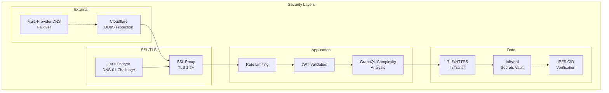
```mermaid
graph TB
    subgraph "Security Layers"
        subgraph "External"
            CF[Cloudflare<br/>DDoS Protection]
            DNS[Multi-Provider DNS<br/>Failover]
        end
        
        subgraph "SSL/TLS"
            LE[Let's Encrypt<br/>DNS-01 Challenge]
            Proxy[SSL Proxy<br/>TLS 1.2+]
        end
        
        subgraph "Application"
            Rate[Rate Limiting]
            JWT[JWT Validation]
            GraphQL[GraphQL Complexity<br/>Analysis]
        end
        
        subgraph "Data"
            Encrypt[TLS/HTTPS<br/>In Transit]
            Vault[Infisical<br/>Secrets Vault]
            CID[IPFS CID<br/>Verification]
        end
    end
    
    CF --> Proxy
    DNS -.-> CF
    LE --> Proxy
    Proxy --> Rate
    Rate --> JWT
    JWT --> GraphQL
    GraphQL --> Encrypt
    Encrypt --> Vault
    Vault -.-> CID
```

**SSL/TLS**:
- Let's Encrypt certificates
- DNS-01 challenge via Cloudflare
- Automatic renewal
- TLS 1.2+ enforced

**Traffic Isolation**:
- Internal service network (not exposed)
- Public endpoints via SSL proxy
- Secrets service isolated from proxy

**DDoS Protection**:
- Cloudflare proxy
- Rate limiting on API
- Complexity analysis on GraphQL

### Data Security

**Encryption**:
- Data in transit: TLS/HTTPS
- Secrets: Infisical vault
- Database: Encrypted at rest (provider-dependent)

**Content Addressing**:
- IPFS CID verification
- SHA256 digest validation
- Tamper detection

---

## Deployment Architecture

### Akash Network

All services deployed on **Akash Network**, a decentralized compute marketplace where providers bid on workloads.

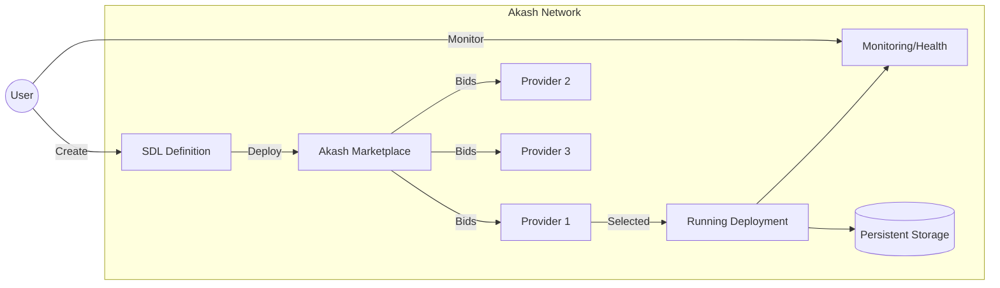
```mermaid
graph LR
    subgraph "Akash Network"
        SDL[SDL Definition] -->|Deploy| Marketplace[Akash Marketplace]
        Marketplace -->|Bids| P1[Provider 1]
        Marketplace -->|Bids| P2[Provider 2]
        Marketplace -->|Bids| P3[Provider 3]
        
        P1 -->|Selected| Deployment[Running Deployment]
        
        Deployment --> Monitor[Monitoring/Health]
        Deployment --> Storage[(Persistent Storage)]
    end
    
    User((User)) -->|Create| SDL
    User -->|Monitor| Monitor
```

**Benefits**:
- Censorship resistance
- Geographic distribution
- Cost efficiency
- No single point of failure

**Deployment Process**:
1. Define SDL (Service Definition Language)
2. Create deployment on Akash
3. Providers bid on deployment
4. Select provider based on price/location/reputation
5. Deployment runs on selected provider
6. Monitor via Akash console

**Persistent Storage**:
- Backed by provider infrastructure
- Data persists across deployments
- Redundant storage recommended

### High Availability

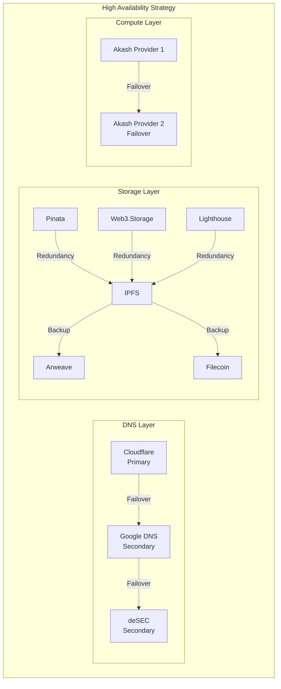
```mermaid
graph TB
    subgraph "High Availability Strategy"
        subgraph "DNS Layer"
            CF[Cloudflare<br/>Primary]
            GCP[Google DNS<br/>Secondary]
            DeSEC[deSEC<br/>Secondary]
        end
        
        subgraph "Storage Layer"
            P1[Pinata]
            P2[Web3.Storage]
            P3[Lighthouse]
            IPFS[IPFS]
            AR[Arweave]
            FC[Filecoin]
        end
        
        subgraph "Compute Layer"
            Akash1[Akash Provider 1]
            Akash2[Akash Provider 2<br/>Failover]
        end
    end
    
    CF -.->|Failover| GCP
    GCP -.->|Failover| DeSEC
    
    P1 -.->|Redundancy| IPFS
    P2 -.->|Redundancy| IPFS
    P3 -.->|Redundancy| IPFS
    IPFS -.->|Backup| AR
    IPFS -.->|Backup| FC
    
    Akash1 -.->|Failover| Akash2
```

**Multi-Provider Strategy**:
- DNS: Cloudflare (primary), Google DNS, deSEC
- IPFS: Multiple pinning services (Pinata, Web3.Storage, Lighthouse)
- Storage: IPFS + Arweave + Filecoin

**Monitoring**:
- Health checks on all services
- Uptime monitoring
- Alert system

**Failover**:
- DNS failover to backup providers
- Service redeployment on different Akash provider
- Data redundancy across storage layers

---

## Integration Points

### External Services

| Service | Purpose | Integration |
|---------|---------|-------------|
| Pinata | IPFS pinning | API |
| Web3.Storage | IPFS pinning | API |
| Lighthouse | IPFS pinning | API |
| Arweave | Permanent storage | Turbo SDK |
| Filecoin | Decentralized storage | API |
| Stripe | Payment processing | API |
| Cloudflare | DNS, SSL, CDN | API + OctoDNS |
| Google Cloud DNS | DNS | API + OctoDNS |
| deSEC | DNS | API + OctoDNS |

### Internal Communication

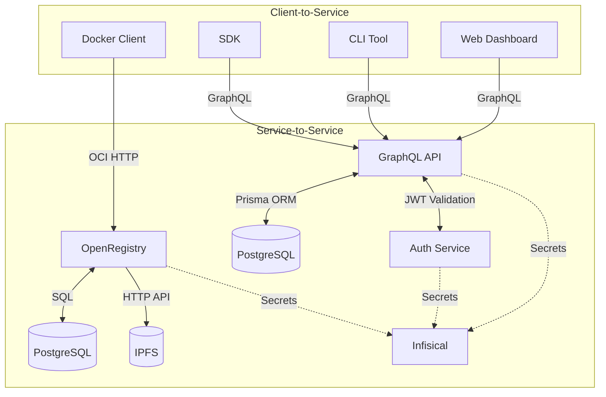
```mermaid
graph TB
    subgraph "Service-to-Service"
        API[GraphQL API] <-->|JWT Validation| Auth[Auth Service]
        API <-->|Prisma ORM| PG[(PostgreSQL)]
        Reg[OpenRegistry] <-->|SQL| RegDB[(PostgreSQL)]
        Reg -->|HTTP API| IPFS[(IPFS)]
        
        API -.->|Secrets| Inf[Infisical]
        Auth -.->|Secrets| Inf
        Reg -.->|Secrets| Inf
    end
    
    subgraph "Client-to-Service"
        WebUI[Web Dashboard] -->|GraphQL| API
        CLI[CLI Tool] -->|GraphQL| API
        SDK[SDK] -->|GraphQL| API
        Docker[Docker Client] -->|OCI HTTP| Reg
    end
```

**Service-to-Service**:
- GraphQL API ↔ Auth Service (JWT validation)
- GraphQL API ↔ PostgreSQL (Prisma ORM)
- OpenRegistry ↔ PostgreSQL (SQL)
- OpenRegistry ↔ IPFS (HTTP API)
- All Services ↔ Infisical (Secrets retrieval)

**Client-to-Service**:
- Web Dashboard → GraphQL API (GraphQL)
- CLI → GraphQL API (GraphQL)
- SDK → GraphQL API (GraphQL)
- Docker Client → Registry (OCI HTTP API)

---

## Scalability

### Horizontal Scaling

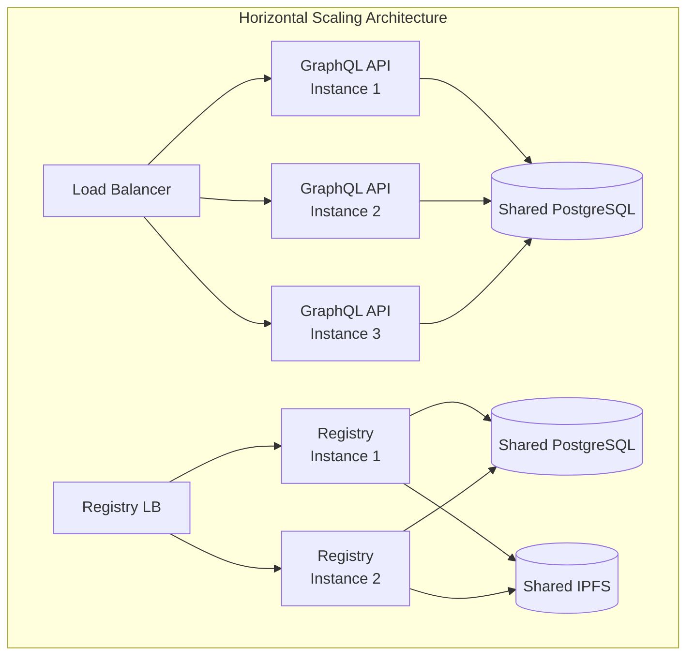
```mermaid
graph TB
    subgraph "Horizontal Scaling Architecture"
        LB[Load Balancer]
        
        LB --> API1[GraphQL API<br/>Instance 1]
        LB --> API2[GraphQL API<br/>Instance 2]
        LB --> API3[GraphQL API<br/>Instance 3]
        
        API1 --> DB[(Shared PostgreSQL)]
        API2 --> DB
        API3 --> DB
        
        RegLB[Registry LB]
        RegLB --> Reg1[Registry<br/>Instance 1]
        RegLB --> Reg2[Registry<br/>Instance 2]
        
        Reg1 --> RegDB[(Shared PostgreSQL)]
        Reg2 --> RegDB
        
        Reg1 --> SharedIPFS[(Shared IPFS)]
        Reg2 --> SharedIPFS
    end
```

**API Server**:
- Multiple instances behind load balancer
- Stateless design (JWT tokens)
- Shared PostgreSQL database

**Registry**:
- Multiple OpenRegistry instances
- Shared IPFS node
- Shared PostgreSQL database

### Storage Scaling

**IPFS**:
- Increase storage allocation (100GB → 500GB+)
- Add IPFS cluster for redundancy
- Multiple pinning services

**Database**:
- PostgreSQL read replicas
- Connection pooling
- Query optimization

### Geographic Distribution

**Multi-Region Deployment**:
- Deploy stacks in different Akash regions
- GeoDNS routing to nearest instance
- Regional IPFS gateways

---

## Monitoring & Observability

### Metrics

```mermaid
graph LR
    subgraph "Monitoring Stack"
        subgraph "Application Metrics"
            AppRate[Request Rate]
            AppLatency[Latency]
            AppErrors[Error Rate]
            GraphQLComp[GraphQL Complexity]
        end
        
        subgraph "Infrastructure Metrics"
            CPU[CPU Usage]
            Memory[Memory Usage]
            Disk[Disk Usage]
            Network[Network Bandwidth]
            IPFS[IPFS Repo Size]
        end
        
        subgraph "Business Metrics"
            Users[Active Users]
            Deploys[Deployments/Day]
            StorageUse[Storage Usage]
            Revenue[Revenue]
        end
    end
    
    AppRate --> Dashboard[Monitoring Dashboard]
    AppLatency --> Dashboard
    AppErrors --> Dashboard
    GraphQLComp --> Dashboard
    CPU --> Dashboard
    Memory --> Dashboard
    Disk --> Dashboard
    Network --> Dashboard
    IPFS --> Dashboard
    Users --> Dashboard
    Deploys --> Dashboard
    StorageUse --> Dashboard
    Revenue --> Dashboard
```

**Application Metrics**:
- Request rate, latency, error rate
- GraphQL query complexity
- Deployment success rate

**Infrastructure Metrics**:
- CPU, memory, disk usage
- Network bandwidth
- IPFS repository size

**Business Metrics**:
- Active users
- Deployments per day
- Storage usage
- Revenue

### Logging

**Structured Logs**:
- JSON format
- Centralized logging
- Log levels (debug, info, warn, error)

**Log Sources**:
- API server logs
- Auth service logs
- Registry logs
- Proxy access logs

### Health Checks

**Endpoints**:
- `GET /health` on all services
- GraphQL introspection
- IPFS node status
- Database connection check

---

## Future Enhancements

### Planned Features

1. **MCP Server Integration**:
   - Model Context Protocol servers for all services
   - Enable AI assistants (Claude, ChatGPT, etc.) to interact with platform
   - **Deployments MCP**: Manage Akash deployments, view logs, check status
   - **Functions MCP**: Create, deploy, and manage serverless functions
   - **Registry MCP**: Push/pull container images, manage repositories
   - **Sites MCP**: Deploy static sites, update content, manage domains
   - **Agents MCP**: Deploy and monitor AI agents
   - **Billing MCP**: View usage, manage subscriptions, access invoices
   - Standardized tool definitions for each service domain
   - Authentication via Personal Access Tokens
   - Real-time status updates and notifications

2. **Registry**:
   - IPFS cluster for redundancy
   - Image signing (Cosign)
   - Vulnerability scanning (Trivy)
   - Cross-region replication
   - Usage analytics
   - Webhook notifications

3. **Platform**:
   - Real-time collaboration
   - AI agent marketplace
   - Template marketplace
   - Custom domain SSL automation
   - Enhanced function analytics and monitoring

4. **Infrastructure**:
   - Multi-cloud support (beyond Akash)
   - Backup/restore automation
   - Disaster recovery
   - Performance optimization

---

## References

### Documentation

- [Functions Documentation](https://github.com/alternatefutures/web-docs.alternatefutures.ai/blob/main/docs/guides/functions.md)
- [Registry Architecture](https://github.com/alternatefutures/web-docs.alternatefutures.ai/blob/main/docs/guides/registry-architecture.md)
- [API Documentation](https://docs.alternatefutures.ai)
- [CLI Reference](https://docs.alternatefutures.ai/cli)
- [SDK Reference](https://docs.alternatefutures.ai/sdk)

### External Resources

- [Akash Network](https://akash.network)
- [IPFS](https://ipfs.tech)
- [Arweave](https://arweave.org)
- [Filecoin](https://filecoin.io)
- [OCI Distribution Spec](https://github.com/opencontainers/distribution-spec)
- [Model Context Protocol](https://modelcontextprotocol.io)

### Related Files

- `admin/CLAUDE.md` - Repository structure and development guide
- `admin/infrastructure/deployments.ts` - Akash deployment configuration
- `.github/DEPLOYMENTS.md` - Deployment tracking
- `.github/CONTRIBUTING.md` - Contribution guidelines

---

## Glossary

- **AF**: Alternate Futures
- **CLI**: Command-Line Interface
- **CID**: Content Identifier (IPFS)
- **DSEQ**: Deployment Sequence Number (Akash)
- **DePIN**: Decentralized Physical Infrastructure Network
- **IPFS**: InterPlanetary File System
- **IPNS**: InterPlanetary Name System
- **JWT**: JSON Web Token
- **MCP**: Model Context Protocol (AI assistant integration standard)
- **OCI**: Open Container Initiative
- **SDL**: Service Definition Language (Akash)
- **SGX**: Software Guard Extensions (Intel trusted execution)
- **SIWE**: Sign-In with Ethereum
- **SSL**: Secure Sockets Layer
- **TLS**: Transport Layer Security

---

**Last Updated**: 2026-01-27  
**Version**: 3.0.0  
**Maintainers**: Alternate Futures Team
