# Alternate Futures Technical Architecture

Comprehensive technical architecture map for the Alternate Futures decentralized cloud platform with **Internet Computer (ICP) integration**.

> **Note**: Components highlighted in light blue represent Internet Computer integration additions.

## Table of Contents

1. [System Overview](#system-overview)
2. [Architecture Layers](#architecture-layers)
3. [Core Services](#core-services)
4. [Client Components](#client-components)
5. [Infrastructure](#infrastructure)
6. [Data Flow](#data-flow)
7. [User Flows](#user-flows)
8. [Technology Stack](#technology-stack)
9. [Repository Map](#repository-map)
10. [Security Architecture](#security-architecture)
11. [Deployment Architecture](#deployment-architecture)

---

## System Overview

Alternate Futures is a **decentralized cloud platform** (forked from Fleek) providing IPFS/Filecoin/Arweave hosting, serverless functions, container registry, and AI agent deployment capabilities with **Internet Computer (ICP) integration** for canister-based deployments.


---

## Architecture Layers

### 1. Client Layer

**Purpose**: User-facing interfaces and tools

| Component | Technology | Repository | Description |
|-----------|-----------|------------|-------------|
| Web Dashboard | Next.js 16 + React 19 | `web-app.alternatefutures.ai` | Main user interface |
| CLI | Node.js (Commander.js) | `package-cloud-cli` | Command-line tool (`af`) |
| SDK | TypeScript | `package-cloud-sdk` | JavaScript SDK for programmatic access |
| Docker Client | OCI Compatible | - | Standard Docker client for registry |

### 2. API Gateway Layer

**Purpose**: Entry points for all client requests


### 3. Service Layer

**Purpose**: Core business logic and functionality

| Service | Purpose | Technology | Repository |
|---------|---------|-----------|------------|
| Sites/Apps | Static site & app hosting | IPFS/Arweave/Filecoin/**ICP** | `service-cloud-api` |
| Functions | Serverless edge functions with Node.js runtime, Web APIs, SGX support | Runtime containers + IPFS/**ICP Canisters** | `service-cloud-api` |
| Agents | AI agent deployment | Container orchestration/**ICP Canisters** | `service-cloud-api` |
| Storage | Decentralized file storage | IPFS/Arweave/Filecoin/**ICP Storage** | `service-cloud-api` |
| Billing | Payment processing | Stripe/**ICP Ledger** | `service-cloud-api` |
| Registry | Container image storage | IPFS + PostgreSQL | Separate stack |

### 4. Storage & Data Layer

**Purpose**: Persistent data storage


### 5. Infrastructure Layer

**Purpose**: Deployment and network infrastructure

- **Akash Network**: Decentralized compute platform hosting containerized services
- **Internet Computer (ICP)**: Decentralized canister hosting for backend services and storage
- **SSL Proxy (Pingap)**: SSL termination and traffic routing
- **DNS**: Multi-provider DNS (Cloudflare, Google, deSEC)
- **Monitoring**: Observability and health checks

---

## Core Services

### 1. GraphQL API (`service-cloud-api`)

**Repository**: `alternatefutures/service-cloud-api`

**Technology Stack**:
- GraphQL Yoga (GraphQL server)
- Prisma (ORM)
- PostgreSQL (database)
- Node.js/TypeScript
- **ICP Agent SDK (for canister communication)**

**Responsibilities**:
- User management
- Project management
- Site/deployment management
- IPFS/Arweave/Filecoin/**ICP** integration
- Billing (Stripe/**ICP Ledger**)
- API key management
- Function management
- Agent deployment
- **ICP canister lifecycle management**

**Endpoints**:
- `https://api.alternatefutures.ai/graphql`

**Key Features**:
- Depth limiting
- Complexity analysis
- Rate limiting
- JWT authentication
- Personal Access Tokens
- **ICP Internet Identity integration**

### 2. Auth Service (`service-auth`)

**Repository**: `alternatefutures/service-auth`

**Technology Stack**:
- Hono (HTTP framework)
- SQLite (database)
- Node.js/TypeScript
- **ICP Agent SDK for Internet Identity**

**Authentication Methods**:
1. Email magic links (passwordless)
2. SMS OTP
3. Web3 wallets (SIWE - Sign-In with Ethereum)
   - MetaMask
   - WalletConnect
   - Phantom
4. **Internet Identity (ICP native authentication)**
5. Social OAuth
   - Google
   - GitHub
   - Twitter
   - Discord
6. Account linking (multiple methods per user)

**Endpoints**:
- `https://auth.alternatefutures.ai`

### 3. Container Registry

**Technology Stack**:
- OpenRegistry (OCI-compliant API)
- IPFS/Kubo (blob storage)
- PostgreSQL (metadata)

**Architecture**:


**Features**:
- OCI-compliant (Docker compatible)
- Content-addressed storage (IPFS)
- Layer deduplication
- Authentication via JWT
- TLS/HTTPS

**Endpoints**:
- `https://registry.alternatefutures.ai`

See [Registry Architecture Documentation](https://github.com/alternatefutures/web-docs.alternatefutures.ai/blob/main/docs/guides/registry-architecture.md) for detailed information.

### 4. Functions Service (Cloud Functions)

**Repository**: `alternatefutures/service-cloud-api`

**Technology Stack**:
- Node.js-compatible runtime
- IPFS (code storage)
- RuntimeRouter (request handling & routing)
- Optional SGX (Software Guard Extensions)
- **ICP Canisters (alternative serverless backend)**

**Capabilities**:
- **Serverless Edge Execution**: Functions run on the edge, close to users
- **Web Standard APIs**: Full support for `fetch`, `Request`, `Response`, and other Web APIs
- **Node.js Compatibility**: Node.js-compatible runtime environment
- **ICP Canister Functions**: Deploy functions as Internet Computer canisters
- **Route Configuration**: Flexible route patterns (`/api/*`, `/users/:id`, etc.)
- **Automatic Scaling**: Scales based on demand (ICP canisters scale automatically)
- **SGX Support**: Optional encrypted execution for confidential computing
- **IPFS Code Storage**: Function code stored and retrieved from IPFS via CID
- **ICP Stable Memory**: Persistent state storage in ICP canisters
- **Custom Domains**: Mount functions on custom domains or use default URLs

**Function Runtime Features**:
- API endpoints creation without managing servers
- Dynamic content generation
- Data processing and transformation
- Webhook handling
- Form processing
- Authentication middleware
- Image processing
- Cross-origin request support (CORS)

**URLs**:
- Default (Akash): `https://<function-slug>.af-functions.app`
- Default (ICP): `https://<canister-id>.ic0.app` or `https://<function-slug>.icp.alternatefutures.ai`
- Custom domains supported

**Management**:
- CLI: `af functions create`, `af functions deploy`
- SDK: Full programmatic API via `@alternatefutures/sdk`
- Web Dashboard: Visual function management

**Architecture**:


**Security**:
- Environment variable support for secrets
- SGX for encrypted execution and attestation
- Code integrity verification via BLAKE3 hash
- **ICP Internet Identity authentication**
- **ICP canister sandboxing and security model**

See [Functions Documentation](https://github.com/alternatefutures/web-docs.alternatefutures.ai/blob/main/docs/guides/functions.md) for detailed usage guide.

### 5. Secrets Management (`service-secrets`)

**Repository**: `alternatefutures/service-secrets`

**Technology**: Infisical (self-hosted)

**Purpose**: Centralized secrets management for all services

**Architecture Decision**: Runs outside the SSL proxy for resilience - if proxy has issues, Infisical remains accessible.

**Endpoints**:
- `https://secrets.alternatefutures.ai`

### 6. ICP Gateway Service (NEW)

**Repository**: `alternatefutures/service-icp-gateway`

**Technology Stack**:
- ICP Agent SDK
- HTTP Gateway for canisters
- Node.js/TypeScript

**Purpose**:
- Canister lifecycle management (create, deploy, upgrade, delete)
- HTTP gateway for canister access
- Cycles management for canister computation
- Identity management and authentication
- Asset canister management for static hosting

**Endpoints**:
- `https://icp.alternatefutures.ai`

### 7. Proxy Service (`infrastructure-proxy`)

**Repository**: `alternatefutures/infrastructure-proxy`

**Technology**: Pingap (based on Pingora)

**Purpose**:
- SSL termination
- Traffic routing
- Load balancing
- Let's Encrypt DNS-01 via Cloudflare

**Deployment**:
- Dedicated IP: 170.75.255.101
- DSEQ: 24758214
- Provider: leet.haus

**Routes**:
- auth.alternatefutures.ai → Auth Service
- api.alternatefutures.ai → GraphQL API
- app.alternatefutures.ai → Web Dashboard
- docs.alternatefutures.ai → Documentation
- alternatefutures.ai → Company Website
- registry.alternatefutures.ai → Container Registry
- **icp.alternatefutures.ai → ICP Gateway Service**

### 8. DNS Management (`infrastructure-dns`)

**Repository**: `alternatefutures/infrastructure-dns`

**Technology**: OctoDNS

**Providers**:
- Cloudflare (primary)
- Google Cloud DNS
- deSEC

**Features**:
- Multi-provider sync
- Automatic failover monitoring
- Version control for DNS records

---

## Client Components

### 1. Web Dashboard

**Repository**: `alternatefutures/web-app.alternatefutures.ai`

**Technology**:
- Next.js 16.0 (with Turbopack)
- React 19.1
- Radix UI (component library)
- Tailwind CSS 4
- TypeScript 5
- next-intl (internationalization)
- next-themes (theming support)
- Lucide React (icons)
- @xyflow/react (flow diagrams)
- react-tracked (state management)
- **ICP Agent SDK (for canister integration)**
- **Internet Identity integration**

**Features**:
- Project management
- Site deployment (IPFS/Arweave/Filecoin/**ICP**)
- Function management (Akash/**ICP Canisters**)
- Agent deployment (Akash/**ICP Canisters**)
- API key management
- **ICP cycles management**
- Billing dashboard
- Real-time deployment logs
- Multi-language support
- Dark/light theme support
- Visual workflow editor

**URL**: `https://app.alternatefutures.ai`

### 2. CLI Tool

**Repository**: `alternatefutures/package-cloud-cli`

**Binary Name**: `af`

**Technology**: Node.js + Commander.js + **ICP Agent SDK**

**Features**:
- Site deployment (`af deploy` with `--target icp` option)
- Site management (`af sites list`)
- Function deployment (`af functions deploy --target icp`)
- **ICP canister management (`af icp create`, `af icp deploy`)**
- Agent deployment
- Authentication (including **Internet Identity**)
- Configuration management
- **Cycles management (`af icp cycles`)**

**Installation**:
```bash
npm install -g @alternatefutures/cli
```

### 3. SDK

**Repository**: `alternatefutures/package-cloud-sdk`

**Technology**: TypeScript (browser + Node.js) + **ICP Agent SDK**

**Features**:
- Programmatic API access
- Site deployment (IPFS/Arweave/Filecoin/**ICP**)
- File upload to IPFS/Arweave/**ICP Storage**
- **ICP canister deployment and management**
- Project management
- TypeScript support
- **Internet Identity authentication support**

**Installation**:
```bash
npm install @alternatefutures/sdk
```

### 4. Documentation Site

**Repository**: `alternatefutures/web-docs.alternatefutures.ai`

**Technology**: VitePress

**Content**:
- Guides
- API reference
- CLI reference
- SDK reference
- Architecture documentation
- **ICP integration guide**
- **Canister development tutorials**

**URL**: `https://docs.alternatefutures.ai`

### 5. Company Website

**Repository**: `alternatefutures/web-alternatefutures.ai`

**Technology**: Astro

**Purpose**: Marketing and company information

**URL**: `https://alternatefutures.ai`

---

## Infrastructure

### Deployment Platforms

All services can be deployed on multiple decentralized platforms:

#### Akash Network Deployments

| Service | DSEQ | Provider | Ingress/IP | Resources |
|---------|------|----------|------------|-----------|
| SSL Proxy | 24758214 | leet.haus | 170.75.255.101 (dedicated) | 2 CPU, 4GB RAM |
| Secrets (Infisical) | 24672527 | Europlots | ddchr1pel5e0p8i0c46drjpclg.ingress.europlots.com | 2 CPU, 4GB RAM, 20GB storage |

#### Internet Computer Deployments (NEW)

| Service | Canister ID | Subnet | Purpose |
|---------|-------------|--------|---------|
| ICP Gateway | TBD | Application | Canister management API |
| Auth Canister | TBD | Application | Internet Identity integration |
| Static Assets | TBD | System | Static site hosting |

**Deployment Management**:
- Repository: `alternatefutures/admin`
- File: `infrastructure/deployments.ts`
- Tools: 
  - Akash MCP Server (for Akash deployments)
  - **DFX CLI (for ICP canister management)**

### Traffic Flow


### DNS Architecture

Multi-provider setup for redundancy:

1. **Cloudflare** (primary)
   - SSL/TLS proxy
   - DDoS protection
   - DNS-01 challenge for Let's Encrypt

2. **Google Cloud DNS** (secondary)
   - Failover support

3. **deSEC** (secondary)
   - Decentralized DNS option

**Management**: OctoDNS with automatic sync across providers

---

## Data Flow

### Site Deployment Flow (with ICP Option)


### Registry Push Flow


### Authentication Flow (with Internet Identity)


---

## User Flows

This section outlines the complete user journey for common platform tasks, from initial onboarding to deploying sites, functions, containers, and AI agents, **including Internet Computer deployment options**.

### 1. User Onboarding and Authentication (with Internet Identity)


**Key Steps**:
1. User visits platform and chooses to sign up or login
2. Multiple authentication options available (email, Web3, **Internet Identity**, OAuth, SMS)
3. **NEW: Internet Identity option with passkey/YubiKey/device authentication**
4. Verification process specific to chosen method
5. JWT token generation upon successful authentication
6. Optional first project setup
7. Access to dashboard

### 2. Site Deployment User Journey (with ICP Option)


**Key Steps**:
1. Choose deployment method (Web UI, CLI, or SDK)
2. Authenticate and access deployment interface
3. Configure build settings and framework detection
4. **NEW: Select storage backend including Internet Computer option**
5. **NEW: For ICP - configure canister, allocate cycles, select subnet**
6. Set up domain (custom, subdomain, default, **or ICP native .ic0.app**)
7. Build and upload process
8. **For ICP: Create asset canister and upload directly**
9. **For traditional: Generate CID and pin content**
10. Configure gateway and DNS
11. Monitor and manage deployment

### 3. Function Deployment Flow (with ICP Canister Option)

```mermaid
flowchart TD
    Start([Deploy Serverless Function]) --> ChooseInterface{Choose Interface}
    
    ChooseInterface -->|CLI| CLIFlow[CLI Workflow]
    ChooseInterface -->|Web UI| WebFlow[Web Dashboard]
    ChooseInterface -->|SDK| SDKFlow[SDK Integration]
    
    CLIFlow --> CLIAuth{Authenticated?}
    CLIAuth -->|No| CLILogin[af login]
    CLIAuth -->|Yes| CLICreate
    CLILogin --> CLICreate[af functions create]
    
    WebFlow --> WebAuth{Authenticated?}
    WebAuth -->|No| WebLogin[Login to Dashboard]
    WebAuth -->|Yes| WebNav
    WebLogin --> WebNav[Navigate to Functions]
    WebNav --> WebNew[Click New Function]
    
    SDKFlow --> SDKInit[Initialize SDK]
    SDKInit --> SDKCreate[Create Function Code]
    
    CLICreate --> FunctionName[Enter Function Name]
    WebNew --> FunctionName
    SDKCreate --> FunctionName
    
    FunctionName --> DeploymentTarget{Deployment Target}
    DeploymentTarget -->|Akash/Traditional| TraditionalRuntime[Traditional Runtime]
    DeploymentTarget -->|ICP Canister| ICPCanisterRuntime[ICP Canister]
    
    TraditionalRuntime --> Runtime{Choose Runtime}
    Runtime -->|Node.js| NodeRuntime[Node.js Runtime]
    Runtime -->|Web APIs| WebRuntime[Web Standards]
    
    NodeRuntime --> CodeSource
    WebRuntime --> CodeSource
    
    ICPCanisterRuntime --> ICPLanguage{Canister Language}
    ICPLanguage -->|Motoko| MotokoLang[Motoko Development]
    ICPLanguage -->|Rust| RustLang[Rust Development]
    ICPLanguage -->|Azle Node.js| AzleLang[Azle JavaScript/TS]
    
    MotokoLang --> CodeSource
    RustLang --> CodeSource
    AzleLang --> CodeSource
    
    CodeSource{Code Source}
    CodeSource -->|Write Inline| InlineEditor[Inline Code Editor]
    CodeSource -->|Upload File| UploadCode[Upload Function File]
    CodeSource -->|Git Repo| GitRepo[Connect Repository]
    CodeSource -->|Template| UseTemplate[Select Template]
    
    InlineEditor --> WriteCode[Write Function Code]
    UploadCode --> CodeReady
    GitRepo --> SelectBranch[Select Branch/Path]
    UseTemplate --> CodeReady
    
    WriteCode --> CodeReady[Code Ready]
    SelectBranch --> CodeReady
    
    CodeReady --> RouteConfig[Configure Routes]
    RouteConfig --> RoutePattern{Route Pattern}
    RoutePattern -->|Path| PathRoute["e.g., /api/*"]
    RoutePattern -->|Exact| ExactRoute["e.g., /users/:id"]
    RoutePattern -->|Wildcard| WildcardRoute["e.g., /*"]
    
    PathRoute --> EnvVars
    ExactRoute --> EnvVars
    WildcardRoute --> EnvVars
    
    EnvVars[Environment Variables]
    EnvVars --> AddSecrets{Add Secrets?}
    AddSecrets -->|Yes| SecretManager[Select from Secrets]
    AddSecrets -->|No| SecurityOptions
    SecretManager --> SecurityOptions
    
    SecurityOptions{Security Features}
    SecurityOptions -->|SGX| EnableSGX[Enable SGX Enclave]
    SecurityOptions -->|Standard| StandardSec[Standard Security]
    SecurityOptions -->|ICP Native| ICPSecurity[ICP Canister Security]
    
    EnableSGX --> DomainConfig
    StandardSec --> DomainConfig
    ICPSecurity --> DomainConfig
    
    DomainConfig{Domain Configuration}
    DomainConfig -->|Default| DefaultDomain[Use *.af-functions.app]
    DomainConfig -->|Custom| CustomDomain[Add Custom Domain]
    DomainConfig -->|ICP Native| ICPNativeDomain[Use *.ic0.app]
    
    DefaultDomain --> ValidateCode
    CustomDomain --> DNSVerify[Verify DNS]
    ICPNativeDomain --> ValidateCode
    DNSVerify --> ValidateCode
    
    ValidateCode[Validate Function Code]
    ValidateCode --> CodeCheck{Valid?}
    CodeCheck -->|No| ShowErrors[Show Validation Errors]
    ShowErrors --> FixCode{Fix Code?}
    FixCode -->|Yes| CodeSource
    FixCode -->|No| CancelDeploy([Deployment Cancelled])
    
    CodeCheck -->|Yes| DeployChoice{Deploy Where?}
    
    DeployChoice -->|Traditional| PackageFunction[Package Function]
    PackageFunction --> HashCode[Generate BLAKE3 Hash]
    HashCode --> UploadIPFS[Upload to IPFS]
    UploadIPFS --> GetCID[Get CID]
    GetCID --> RegisterFunc[Register in Database]
    RegisterFunc --> ConfigRouter[Configure RuntimeRouter]
    ConfigRouter --> DeployRuntime[Deploy Runtime]
    
    DeployChoice -->|ICP| BuildCanister[Build Canister]
    BuildCanister --> AllocateCycles[Allocate Cycles]
    AllocateCycles --> CreateICPCanister[Create Canister]
    CreateICPCanister --> InstallCode[Install Wasm Code]
    InstallCode --> DeployRuntime
    
    DeployRuntime --> HealthCheck{Health Check}
    HealthCheck -->|Failed| DeployError[Deployment Error]
    HealthCheck -->|Success| FunctionLive[Function Live]
    
    DeployError --> Retry{Retry?}
    Retry -->|Yes| DeployRuntime
    Retry -->|No| CancelDeploy
    
    FunctionLive --> GetURL[Get Function URL]
    GetURL --> TestFunction{Test Function?}
    
    TestFunction -->|Yes| SendRequest[Send Test Request]
    SendRequest --> ViewResponse[View Response]
    ViewResponse --> TestResult{Works?}
    TestResult -->|No| Debug[Debug Function]
    TestResult -->|Yes| MonitorFunc
    Debug --> ViewLogs[View Function Logs]
    ViewLogs --> FixCode
    
    TestFunction -->|No| MonitorFunc
    
    MonitorFunc[Monitor Function]
    MonitorFunc --> Metrics[View Metrics]
    Metrics --> MetricsData{Metrics}
    MetricsData --> Invocations[Invocations Count]
    MetricsData --> Latency[Response Time]
    MetricsData --> Errors[Error Rate]
    MetricsData --> Traffic[Traffic Patterns]
    
    Invocations --> Management
    Latency --> Management
    Errors --> Management
    Traffic --> Management
    
    Management{Function Management}
    Management -->|Update| UpdateFunc[Update Function Code]
    Management -->|Scale| ScaleFunc[Adjust Resources]
    Management -->|Delete| DeleteFunc[Delete Function]
    Management -->|Done| End([Function Deployed])
    
    UpdateFunc --> CodeSource
    ScaleFunc --> MonitorFunc
    DeleteFunc --> End
    
    style Start fill:#e1f5e1
    style End fill:#e1f5e1
    style CancelDeploy fill:#ffe1e1
    style FunctionLive fill:#e1e5f5
    style DeployError fill:#ffe1e1
    style ICPCanisterRuntime fill:#c5f0ff,stroke:#0066cc,stroke-width:3px
    style ICPLanguage fill:#c5f0ff,stroke:#0066cc,stroke-width:3px
    style MotokoLang fill:#c5f0ff,stroke:#0066cc,stroke-width:3px
    style RustLang fill:#c5f0ff,stroke:#0066cc,stroke-width:3px
    style AzleLang fill:#c5f0ff,stroke:#0066cc,stroke-width:3px
    style ICPSecurity fill:#c5f0ff,stroke:#0066cc,stroke-width:3px
    style ICPNativeDomain fill:#c5f0ff,stroke:#0066cc,stroke-width:3px
    style BuildCanister fill:#c5f0ff,stroke:#0066cc,stroke-width:3px
    style AllocateCycles fill:#c5f0ff,stroke:#0066cc,stroke-width:3px
    style CreateICPCanister fill:#c5f0ff,stroke:#0066cc,stroke-width:3px
    style InstallCode fill:#c5f0ff,stroke:#0066cc,stroke-width:3px
```



**Key Steps**:
1. Choose deployment interface (CLI, Web UI, or SDK)
2. **NEW: Select deployment target - Traditional (Akash) or ICP Canister**
3. **For ICP: Choose canister language (Motoko, Rust, or Azle)**
4. Provide function code (inline, upload, Git, or template)
5. Configure routes and patterns
6. Set environment variables and secrets
7. **For ICP: Use ICP native canister security**
8. Configure domain (default, custom, **or ICP native .ic0.app**)
9. Validate and package function
10. **For ICP: Build canister, allocate cycles, create canister, install Wasm**
11. **For Traditional: Upload to IPFS, get CID, deploy runtime**
12. Health check and get function URL
13. Test function and view metrics
14. Monitor and manage function

### 4. Container Registry User Flow

(Same as before - no ICP changes for container registry)

### 5. AI Agent Deployment Flow (with ICP Canister Option)


**Key Steps**:
1. **NEW: Choose agent type including ICP Canister option**
2. **For ICP Canister: Choose on-chain or off-chain AI model**
3. **For on-chain: Select Motoko or Rust for canister development**
4. Configure agent source and behavior
5. Set up AI model and parameters
6. **NEW: Choose deployment target - Akash or ICP**
7. **For ICP: Allocate cycles, configure stable memory, select subnet**
8. Configure resources based on platform
9. Set environment variables and secrets
10. **Configure networking including ICP native endpoint option**
11. **Set up domain including ICP native .ic0.app option**
12. **Configure data persistence including ICP stable memory**
13. Enable monitoring and logging
14. **Deploy to chosen platform (Akash bidding or ICP canister creation)**
15. Health check and endpoint access
16. Test agent functionality
17. Monitor metrics including **ICP cycles usage**
18. Manage agent

### 6. Billing and Subscription Management Flow

(Same as before - billing flow remains unchanged)

---

## Technology Stack

### Backend

| Layer | Technology | Purpose |
|-------|-----------|---------|
| API Framework | GraphQL Yoga | GraphQL server |
| ORM | Prisma | Database abstraction |
| HTTP Framework | Hono | Auth service HTTP server |
| Database | PostgreSQL | Primary relational database |
| Database (Auth) | SQLite | Auth service local database |
| Runtime | Node.js/TypeScript | JavaScript runtime |
| Testing | Vitest | Unit/integration testing |
| **ICP Integration** | **ICP Agent SDK** | **Canister communication** |
| **ICP Development** | **dfx CLI** | **Canister deployment** |

### Frontend

| Layer | Technology | Purpose |
|-------|-----------|---------|
| Framework | Next.js 16 | React framework with App Router |
| UI Library | React 19 | UI rendering |
| Component Library | Radix UI | Accessible component primitives |
| Styling | Tailwind CSS 4 | Utility-first CSS framework |
| Icons | Lucide React | Icon library |
| Flow Diagrams | @xyflow/react | Interactive node-based diagrams |
| State Management | react-tracked | State management |
| Internationalization | next-intl | i18n support |
| Theming | next-themes | Dark/light mode support |
| Build Tool | Turbopack | Next.js bundler |
| **ICP Integration** | **@dfinity/agent** | **ICP authentication & calls** |
| **ICP Auth** | **@dfinity/auth-client** | **Internet Identity** |

### Storage

| Technology | Purpose | Provider/Options |
|-----------|---------|------------------|
| IPFS | Content-addressed storage | Pinata, Web3.Storage, Lighthouse |
| Arweave | Permanent storage | Turbo SDK |
| Filecoin | Decentralized storage | - |
| **Internet Computer** | **Canister storage & hosting** | **ICP Stable Memory, Asset Canisters** |
| PostgreSQL | Relational data | Akash-hosted |
| SQLite | Local auth data | File-based |

### Infrastructure

| Technology | Purpose | Notes |
|-----------|---------|-------|
| Akash Network | Decentralized compute | Containerized services |
| **Internet Computer** | **Decentralized canisters** | **Backend services & storage** |
| Pingap/Pingora | SSL proxy | High-performance reverse proxy |
| OctoDNS | DNS management | Multi-provider sync |
| Infisical | Secrets management | Self-hosted |
| Let's Encrypt | SSL certificates | DNS-01 via Cloudflare |

### Tools & CLI

| Tool | Technology | Purpose |
|------|-----------|---------|
| CLI | Commander.js + **dfx** | Command-line interface |
| SDK | TypeScript + **ICP Agent SDK** | Programmatic API access |
| Linter (Backend) | Biome | Code linting/formatting |
| Linter (Frontend) | ESLint | Code linting/formatting |
| Package Manager | pnpm | Monorepo package management |
| **ICP Development** | **dfx CLI** | **Canister management** |

---

## Deployment Architecture

### Multi-Platform Deployment

Services can be deployed on multiple decentralized platforms for maximum resilience and flexibility:

### Akash Network

All containerized services deployed on **Akash Network**, a decentralized compute marketplace where providers bid on workloads.


**Benefits**:
- Censorship resistance
- Geographic distribution
- Cost efficiency
- No single point of failure

**Deployment Process**:
1. Define SDL (Service Definition Language)
2. Create deployment on Akash
3. Providers bid on deployment
4. Select provider based on price/location/reputation
5. Deployment runs on selected provider
6. Monitor via Akash console

### Internet Computer (NEW)

Backend services and storage canisters deployed on **Internet Computer**, a blockchain-based decentralized compute platform.


**Benefits**:
- On-chain computation
- Deterministic execution
- Native authentication (Internet Identity)
- Automatic scaling
- Built-in storage (stable memory)
- Direct HTTP requests to canisters

**Deployment Process**:
1. Write canister code (Motoko, Rust, or Azle)
2. Build canister with dfx
3. Allocate cycles for computation
4. Create canister on ICP
5. Install Wasm code to canister
6. Monitor via canister dashboard

### High Availability (with ICP Integration)


**Multi-Platform Strategy**:
- DNS: Cloudflare (primary), Google DNS, deSEC
- IPFS: Multiple pinning services (Pinata, Web3.Storage, Lighthouse)
- Storage: IPFS + Arweave + Filecoin + **ICP Stable Memory**
- Compute: Akash Network + **Internet Computer**

**Monitoring**:
- Health checks on all services
- Uptime monitoring
- Alert system
- **ICP cycles monitoring**

**Failover**:
- DNS failover to backup providers
- Service redeployment on different Akash provider
- **Canister redeployment on different ICP subnet**
- Data redundancy across storage layers

---

## Integration Points

### External Services

| Service | Purpose | Integration |
|---------|---------|-------------|
| Pinata | IPFS pinning | API |
| Web3.Storage | IPFS pinning | API |
| Lighthouse | IPFS pinning | API |
| Arweave | Permanent storage | Turbo SDK |
| Filecoin | Decentralized storage | API |
| **Internet Computer** | **Canister hosting** | **ICP Agent SDK, dfx CLI** |
| Stripe | Payment processing | API |
| Cloudflare | DNS, SSL, CDN | API + OctoDNS |
| Google Cloud DNS | DNS | API + OctoDNS |
| deSEC | DNS | API + OctoDNS |

### Internal Communication


**Service-to-Service**:
- GraphQL API ↔ Auth Service (JWT validation)
- GraphQL API ↔ PostgreSQL (Prisma ORM)
- OpenRegistry ↔ PostgreSQL (SQL)
- OpenRegistry ↔ IPFS (HTTP API)
- **GraphQL API ↔ ICP Gateway (Agent SDK)**
- **ICP Gateway ↔ ICP Canisters (Canister calls)**
- All Services ↔ Infisical (Secrets retrieval)

**Client-to-Service**:
- Web Dashboard → GraphQL API (GraphQL)
- CLI → GraphQL API (GraphQL)
- SDK → GraphQL API (GraphQL)
- Docker Client → Registry (OCI HTTP API)
- **Web Dashboard → ICP Gateway (Agent SDK)**
- **CLI → ICP Gateway (dfx/Agent SDK)**
- **SDK → ICP Gateway (Agent SDK)**

---

## Scalability

### Horizontal Scaling


**API Server**:
- Multiple instances behind load balancer
- Stateless design (JWT tokens)
- Shared PostgreSQL database

**Registry**:
- Multiple OpenRegistry instances
- Shared IPFS node
- Shared PostgreSQL database

**ICP Canisters (NEW)**:
- Automatic horizontal scaling via boundary nodes
- Multiple canister instances
- Distributed across subnets

### Storage Scaling

**IPFS**:
- Increase storage allocation (100GB → 500GB+)
- Add IPFS cluster for redundancy
- Multiple pinning services

**ICP Storage (NEW)**:
- Stable memory scaling (up to 400GB per canister)
- Multiple asset canisters for large applications
- Automatic replication across subnet nodes

**Database**:
- PostgreSQL read replicas
- Connection pooling
- Query optimization

### Geographic Distribution

**Multi-Region Deployment**:
- Deploy stacks in different Akash regions
- **Deploy canisters across different ICP subnets**
- GeoDNS routing to nearest instance
- Regional IPFS gateways
- **ICP boundary nodes provide automatic geographic distribution**

---

## Future Enhancements

### Planned Features

1. **Enhanced ICP Integration**:
   - **Full Internet Identity integration across all services**
   - **ICP Ledger integration for payments**
   - **SNS (Service Nervous System) DAO governance**
   - **ICRC-1 token support**
   - **Chain Fusion for cross-chain integration**
   - **Threshold signatures for secure multi-chain operations**

2. **MCP Server Integration**:
   - Model Context Protocol servers for all services
   - Enable AI assistants (Claude, ChatGPT, etc.) to interact with platform
   - **Deployments MCP**: Manage Akash/ICP deployments, view logs, check status
   - **Functions MCP**: Create, deploy, and manage serverless functions on Akash/ICP
   - **Registry MCP**: Push/pull container images, manage repositories
   - **Sites MCP**: Deploy static sites to IPFS/Arweave/ICP, update content
   - **Agents MCP**: Deploy and monitor AI agents on Akash/ICP
   - **Billing MCP**: View usage, manage subscriptions, access invoices
   - **ICP MCP**: Manage canisters, cycles, Internet Identity
   - Standardized tool definitions for each service domain
   - Authentication via Personal Access Tokens
   - Real-time status updates and notifications

3. **Registry**:
   - IPFS cluster for redundancy
   - Image signing (Cosign)
   - Vulnerability scanning (Trivy)
   - Cross-region replication
   - Usage analytics
   - Webhook notifications

4. **Platform**:
   - Real-time collaboration
   - AI agent marketplace
   - Template marketplace
   - Custom domain SSL automation
   - Enhanced function analytics and monitoring
   - **ICP canister marketplace**
   - **On-chain governance for platform decisions**

5. **Infrastructure**:
   - Multi-cloud support (Akash + ICP + future platforms)
   - Backup/restore automation
   - Disaster recovery
   - Performance optimization
   - **Cross-chain bridges for asset transfers**

---

## References

### Documentation

- [Functions Documentation](https://github.com/alternatefutures/web-docs.alternatefutures.ai/blob/main/docs/guides/functions.md)
- [Registry Architecture](https://github.com/alternatefutures/web-docs.alternatefutures.ai/blob/main/docs/guides/registry-architecture.md)
- [API Documentation](https://docs.alternatefutures.ai)
- [CLI Reference](https://docs.alternatefutures.ai/cli)
- [SDK Reference](https://docs.alternatefutures.ai/sdk)

### External Resources

- [Akash Network](https://akash.network)
- **[Internet Computer](https://internetcomputer.org)**
- **[ICP Developer Docs](https://internetcomputer.org/docs)**
- **[Motoko Language](https://internetcomputer.org/docs/current/motoko/intro)**
- **[Internet Identity](https://identity.ic0.app)**
- [IPFS](https://ipfs.tech)
- [Arweave](https://arweave.org)
- [Filecoin](https://filecoin.io)
- [OCI Distribution Spec](https://github.com/opencontainers/distribution-spec)
- [Model Context Protocol](https://modelcontextprotocol.io)

### Related Files

- `admin/CLAUDE.md` - Repository structure and development guide
- `admin/infrastructure/deployments.ts` - Akash deployment configuration
- `.github/DEPLOYMENTS.md` - Deployment tracking
- `.github/CONTRIBUTING.md` - Contribution guidelines

---

## Glossary

- **AF**: Alternate Futures
- **CLI**: Command-Line Interface
- **CID**: Content Identifier (IPFS)
- **DSEQ**: Deployment Sequence Number (Akash)
- **DePIN**: Decentralized Physical Infrastructure Network
- **ICP**: Internet Computer Protocol
- **II**: Internet Identity (ICP's authentication system)
- **dfx**: DFINITY Canister SDK command-line tool
- **Canister**: Smart contract on Internet Computer
- **Cycles**: Computation units on Internet Computer
- **Stable Memory**: Persistent storage in ICP canisters
- **Motoko**: Programming language for ICP canisters
- **Azle**: TypeScript/JavaScript framework for ICP
- **IPFS**: InterPlanetary File System
- **IPNS**: InterPlanetary Name System
- **JWT**: JSON Web Token
- **MCP**: Model Context Protocol (AI assistant integration standard)
- **OCI**: Open Container Initiative
- **SDL**: Service Definition Language (Akash)
- **SGX**: Software Guard Extensions (Intel trusted execution)
- **SIWE**: Sign-In with Ethereum
- **SNS**: Service Nervous System (ICP DAO framework)
- **SSL**: Secure Sockets Layer
- **TLS**: Transport Layer Security

---

**Last Updated**: 2026-01-27  
**Version**: 4.0.0 (Internet Computer Integration)  
**Maintainers**: Alternate Futures Team

**Changes in v4.0.0**:
- ✨ Added Internet Computer (ICP) integration across all architecture layers
- ✨ Added ICP as deployment platform option for sites, functions, and agents
- ✨ Integrated Internet Identity for authentication
- ✨ Added ICP canister storage and stable memory options
- ✨ Updated all user flows to include ICP deployment paths
- 🎨 Highlighted all ICP additions with light blue color (#c5f0ff) for easy identification
- 📚 Added ICP-specific documentation and glossary terms
- 🔄 Updated technology stack with ICP Agent SDK and dfx CLI
- 🌐 Enhanced multi-platform deployment architecture
