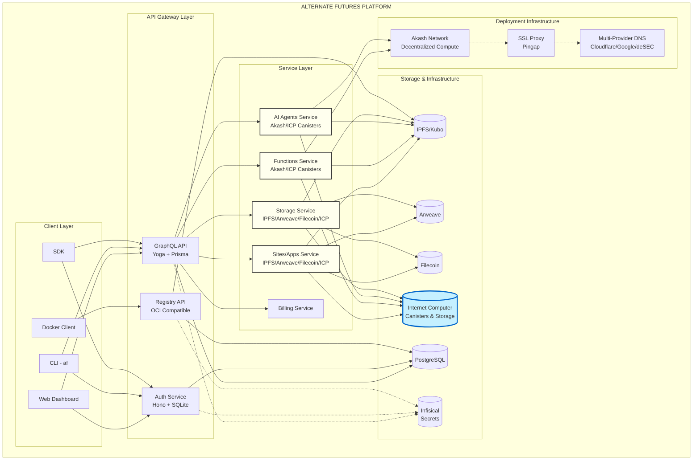
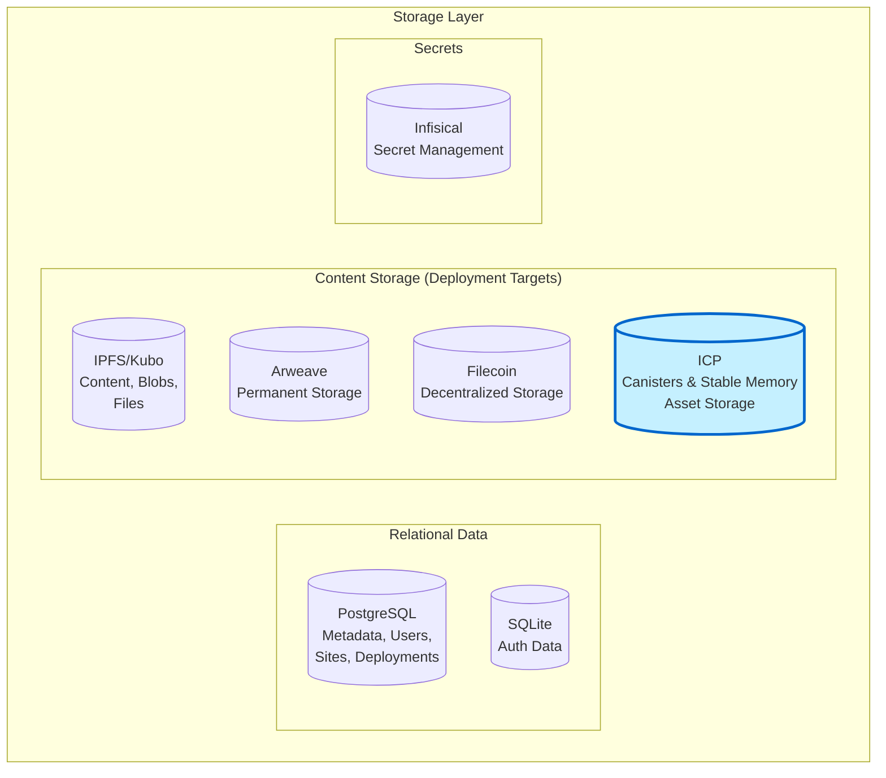
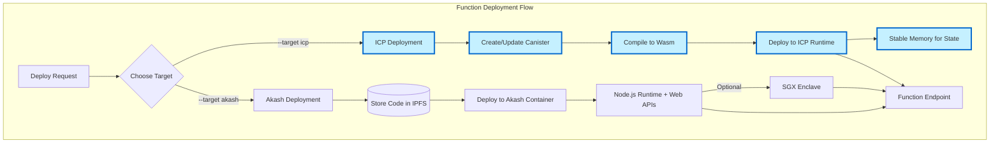
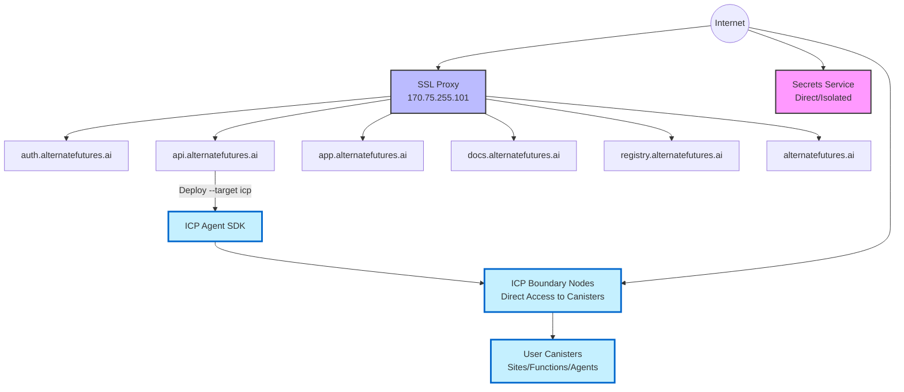
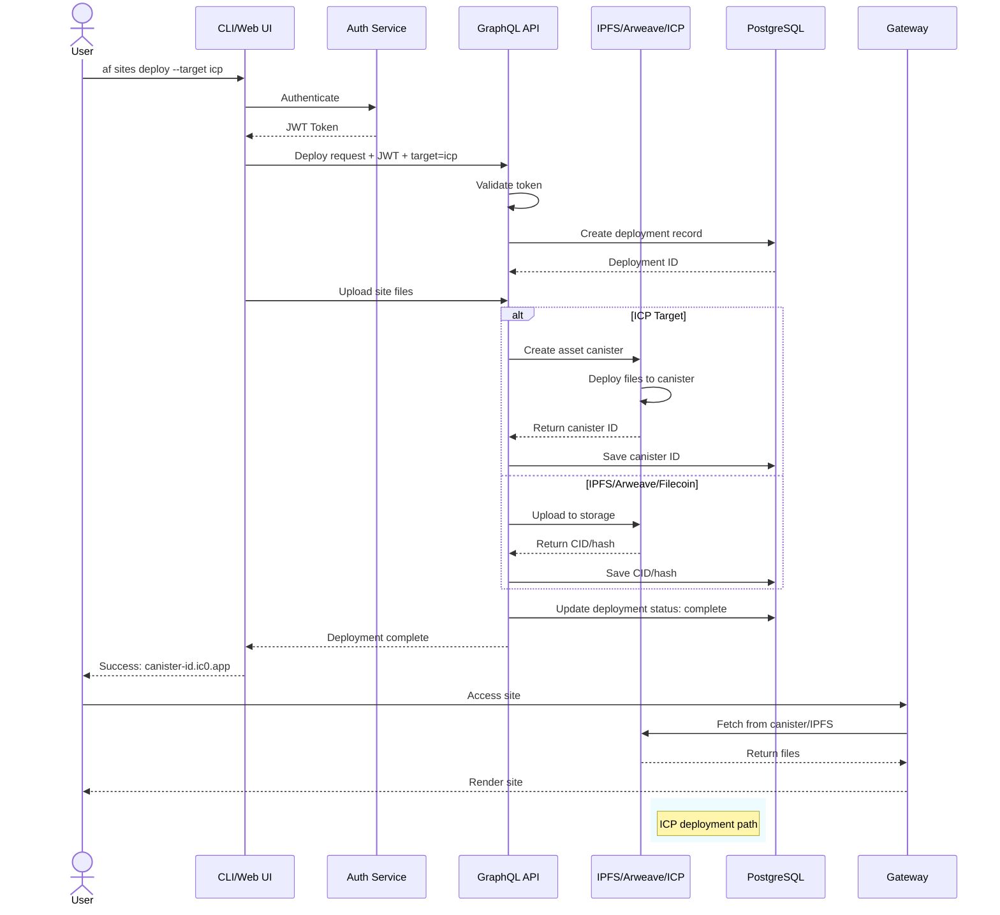
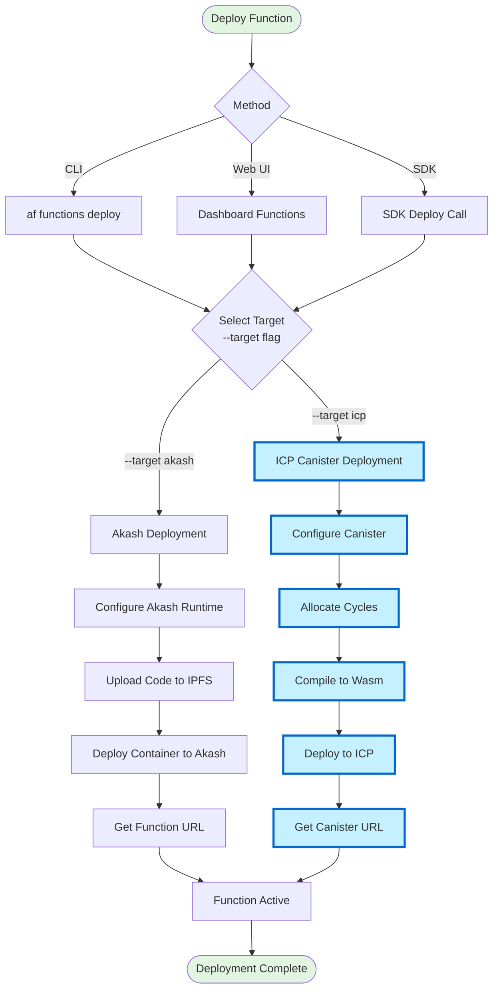
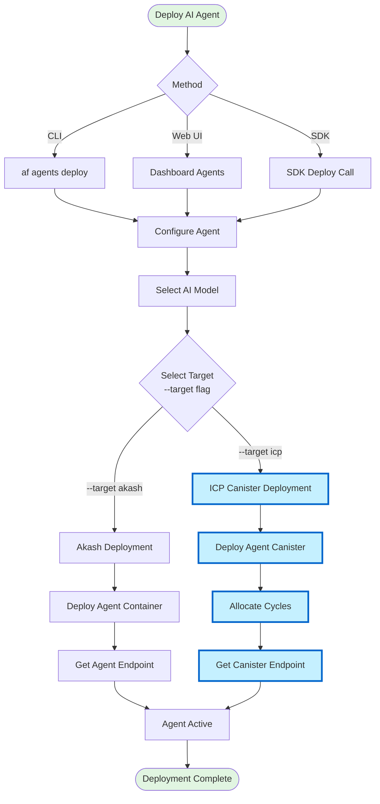

# Alternate Futures Technical Architecture

Comprehensive technical architecture map for the Alternate Futures decentralized cloud platform with **Internet Computer (ICP) integration**.

```
╔═══════════════════════════════════════════════════════════════════════════════╗
║  📘 NOTE: Components highlighted in light blue represent Internet Computer    ║
║          (ICP) integration additions throughout this document.                ║
╚═══════════════════════════════════════════════════════════════════════════════╝
```

> **🔵 Key Visual Identifier**: All ICP-related components in diagrams use light blue fill (#c5f0ff) with dark blue borders (#0066cc, 3px stroke).

## Table of Contents

1. [System Overview](#system-overview)
2. [Architecture Layers](#architecture-layers)
3. [Core Services](#core-services)
4. [Client Components](#client-components)
5. [Infrastructure](#infrastructure)
6. [Data Flow](#data-flow)
7. [User Flows](#user-flows)
8. [Technology Stack](#technology-stack)
9. [Repository Map](#repository-map)
10. [Security Architecture](#security-architecture)
11. [Deployment Architecture](#deployment-architecture)

---

## System Overview

Alternate Futures is a **decentralized cloud platform** (forked from Fleek) providing IPFS/Filecoin/Arweave/**ICP** hosting, serverless functions, container registry, and AI agent deployment capabilities.



---

## Architecture Layers

### 1. Client Layer

**Purpose**: User-facing interfaces and tools

| Component | Technology | Repository | Description |
|-----------|-----------|------------|-------------|
| Web Dashboard | Next.js 16 + React 19 | `web-app.alternatefutures.ai` | Main user interface |
| CLI | Node.js (Commander.js) | `package-cloud-cli` | Command-line tool (`af`) |
| SDK | TypeScript | `package-cloud-sdk` | JavaScript SDK for programmatic access |
| Docker Client | OCI Compatible | - | Standard Docker client for registry |

### 2. API Gateway Layer

**Purpose**: Entry points for all client requests


### 3. Service Layer

**Purpose**: Core business logic and functionality

| Service | Purpose | Technology | Deployment Targets |
|---------|---------|-----------|-------------------|
| Sites/Apps | Static site & app hosting | IPFS/Arweave/Filecoin/**ICP** | `--target ipfs\|arweave\|filecoin\|icp` |
| Functions | Serverless edge functions with Node.js runtime, Web APIs, SGX support | Akash containers + **ICP Canisters** | `--target akash\|icp` |
| Agents | AI agent deployment | Akash containers + **ICP Canisters** | `--target akash\|icp` |
| Storage | Decentralized file storage | IPFS/Arweave/Filecoin/**ICP Stable Memory** | `--target ipfs\|arweave\|filecoin\|icp` |
| Billing | Payment processing | Stripe | N/A |
| Registry | Container image storage | IPFS + PostgreSQL | N/A |

### 4. Storage & Data Layer

**Purpose**: Persistent data storage



### 5. Infrastructure Layer

**Purpose**: Deployment and network infrastructure

- **Akash Network**: Decentralized compute platform hosting containerized services
- **Internet Computer (ICP)**: Deployment target for canisters (sites, functions, agents, storage)
- **SSL Proxy (Pingap)**: SSL termination and traffic routing
- **DNS**: Multi-provider DNS (Cloudflare, Google, deSEC)
- **Monitoring**: Observability and health checks

---

## Core Services

### 1. GraphQL API (`service-cloud-api`)

**Repository**: `alternatefutures/service-cloud-api`

**Technology Stack**:
- GraphQL Yoga (GraphQL server)
- Prisma (ORM)
- PostgreSQL (database)
- Node.js/TypeScript
- **ICP Agent SDK (for canister deployment)**

**Responsibilities**:
- User management
- Project management
- Site/deployment management
- IPFS/Arweave/Filecoin/**ICP** integration
- Billing (Stripe)
- API key management
- Function management (Akash/**ICP Canisters**)
- Agent deployment (Akash/**ICP Canisters**)
- **ICP canister deployment and lifecycle management**

**Endpoints**:
- `https://api.alternatefutures.ai/graphql`

**Key Features**:
- Depth limiting
- Complexity analysis
- Rate limiting
- JWT authentication
- Personal Access Tokens
- **ICP Agent SDK integration for canister management**

### 2. Auth Service (`service-auth`)

**Repository**: `alternatefutures/service-auth`

**Technology Stack**:
- Hono (HTTP framework)
- SQLite (database)
- Node.js/TypeScript
- **ICP Agent SDK for Internet Identity**

**Authentication Methods**:
1. Email magic links (passwordless)
2. SMS OTP
3. Web3 wallets (SIWE - Sign-In with Ethereum)
   - MetaMask
   - WalletConnect
   - Phantom
4. **Internet Identity (ICP native authentication)**
5. Social OAuth
   - Google
   - GitHub
   - Twitter
   - Discord
6. Account linking (multiple methods per user)

**Endpoints**:
- `https://auth.alternatefutures.ai`

### 3. Container Registry

**Technology Stack**:
- OpenRegistry (OCI-compliant API)
- IPFS/Kubo (blob storage)
- PostgreSQL (metadata)

**Architecture**:


**Features**:
- OCI-compliant (Docker compatible)
- Content-addressed storage (IPFS)
- Layer deduplication
- Authentication via JWT
- TLS/HTTPS

**Endpoints**:
- `https://registry.alternatefutures.ai`

See [Registry Architecture Documentation](https://github.com/alternatefutures/web-docs.alternatefutures.ai/blob/main/docs/guides/registry-architecture.md) for detailed information.

### 4. Functions Service (Cloud Functions)

**Repository**: `alternatefutures/service-cloud-api`

**Technology Stack**:
- Node.js-compatible runtime
- IPFS (code storage)
- RuntimeRouter (request handling & routing)
- Optional SGX (Software Guard Extensions)
- **ICP Canisters (as deployment target for serverless functions)**

**Deployment Targets**:
- **Akash**: Traditional container-based serverless runtime
- **ICP Canisters**: Internet Computer canister-based functions

**Capabilities**:
- **Serverless Edge Execution**: Functions run on the edge, close to users
- **Web Standard APIs**: Full support for `fetch`, `Request`, `Response`, and other Web APIs
- **Node.js Compatibility**: Node.js-compatible runtime environment
- **Multi-Target Deployment**: Deploy to Akash or ICP based on needs
- **Route Configuration**: Flexible route patterns (`/api/*`, `/users/:id`, etc.)
- **Automatic Scaling**: Scales based on demand (ICP canisters scale automatically)
- **SGX Support**: Optional encrypted execution for confidential computing (Akash)
- **IPFS Code Storage**: Function code stored and retrieved from IPFS via CID
- **ICP Stable Memory**: Persistent state storage in ICP canisters
- **Custom Domains**: Mount functions on custom domains or use default URLs

**Function Runtime Features**:
- API endpoints creation without managing servers
- Dynamic content generation
- Data processing and transformation
- Webhook handling
- Form processing
- Authentication middleware
- Image processing
- Cross-origin request support (CORS)

**URLs**:
- Default (Akash): `https://<function-slug>.af-functions.app`
- Default (ICP): `https://<canister-id>.ic0.app` or custom domain
- Custom domains supported

**Management**:
- CLI: `af functions deploy --target akash|icp`
- SDK: Full programmatic API via `@alternatefutures/sdk`
- Web Dashboard: Visual function management with target selection

**Architecture**:



**Security**:
- Environment variable support for secrets
- SGX for encrypted execution and attestation (Akash)
- Code integrity verification via BLAKE3 hash
- **ICP Internet Identity authentication**
- **ICP canister sandboxing and security model**

See [Functions Documentation](https://github.com/alternatefutures/web-docs.alternatefutures.ai/blob/main/docs/guides/functions.md) for detailed usage guide.

### 5. Secrets Management (`service-secrets`)

**Repository**: `alternatefutures/service-secrets`

**Technology**: Infisical (self-hosted)

**Purpose**: Centralized secrets management for all services

**Architecture Decision**: Runs outside the SSL proxy for resilience - if proxy has issues, Infisical remains accessible.

**Endpoints**:
- `https://secrets.alternatefutures.ai`

### 6. Proxy Service (`infrastructure-proxy`)

**Repository**: `alternatefutures/infrastructure-proxy`

**Technology**: Pingap (based on Pingora)

**Purpose**:
- SSL termination
- Traffic routing
- Load balancing
- Let's Encrypt DNS-01 via Cloudflare

**Deployment**:
- Dedicated IP: 170.75.255.101
- DSEQ: 24758214
- Provider: leet.haus

**Routes**:
- auth.alternatefutures.ai → Auth Service
- api.alternatefutures.ai → GraphQL API
- app.alternatefutures.ai → Web Dashboard
- docs.alternatefutures.ai → Documentation
- alternatefutures.ai → Company Website
- registry.alternatefutures.ai → Container Registry

### 7. DNS Management (`infrastructure-dns`)

**Repository**: `alternatefutures/infrastructure-dns`

**Technology**: OctoDNS

**Providers**:
- Cloudflare (primary)
- Google Cloud DNS
- deSEC

**Features**:
- Multi-provider sync
- Automatic failover monitoring
- Version control for DNS records

---

## Client Components

### 1. Web Dashboard

**Repository**: `alternatefutures/web-app.alternatefutures.ai`

**Technology**:
- Next.js 16.0 (with Turbopack)
- React 19.1
- Radix UI (component library)
- Tailwind CSS 4
- TypeScript 5
- next-intl (internationalization)
- next-themes (theming support)
- Lucide React (icons)
- @xyflow/react (flow diagrams)
- react-tracked (state management)
- **ICP Agent SDK (for canister integration)**
- **Internet Identity integration**

**Features**:
- Project management
- Site deployment with target selection (IPFS/Arweave/Filecoin/**ICP**)
- Function management with target selection (Akash/**ICP**)
- Agent deployment with target selection (Akash/**ICP**)
- API key management
- **ICP cycles management UI**
- Billing dashboard
- Real-time deployment logs
- Multi-language support
- Dark/light theme support
- Visual workflow editor

**URL**: `https://app.alternatefutures.ai`

### 2. CLI Tool

**Repository**: `alternatefutures/package-cloud-cli`

**Binary Name**: `af`

**Technology**: Node.js + Commander.js + **ICP Agent SDK** + **dfx (ICP CLI)**

**Features**:
- Site deployment: `af sites deploy --target icp|ipfs|arweave|filecoin`
- Site management: `af sites list`
- Function deployment: `af functions deploy --target akash|icp`
- Agent deployment: `af agents deploy --target akash|icp`
- **ICP canister management: `af icp canister create`, `af icp canister deploy`**
- Authentication (including **Internet Identity**)
- Configuration management
- **Cycles management: `af icp cycles top-up`**

**Installation**:
```bash
npm install -g @alternatefutures/cli
```

### 3. SDK

**Repository**: `alternatefutures/package-cloud-sdk`

**Technology**: TypeScript (browser + Node.js) + **ICP Agent SDK**

**Features**:
- Programmatic API access
- Site deployment with target parameter (IPFS/Arweave/Filecoin/**ICP**)
- File upload to IPFS/Arweave/**ICP Storage**
- Function deployment to Akash/**ICP Canisters**
- **ICP canister deployment and management**
- Project management
- TypeScript support
- **Internet Identity authentication support**

**Installation**:
```bash
npm install @alternatefutures/sdk
```

### 4. Documentation Site

**Repository**: `alternatefutures/web-docs.alternatefutures.ai`

**Technology**: VitePress

**Content**:
- Guides
- API reference
- CLI reference
- SDK reference
- Architecture documentation
- **ICP deployment guide**
- **Canister development tutorials**

**URL**: `https://docs.alternatefutures.ai`

### 5. Company Website

**Repository**: `alternatefutures/web-alternatefutures.ai`

**Technology**: Astro

**Purpose**: Marketing and company information

**URL**: `https://alternatefutures.ai`

---

## Infrastructure

### Deployment Platforms

All services can be deployed on multiple decentralized platforms:

#### Akash Network Deployments

| Service | DSEQ | Provider | Ingress/IP | Resources |
|---------|------|----------|------------|-----------|
| SSL Proxy | 24758214 | leet.haus | 170.75.255.101 (dedicated) | 2 CPU, 4GB RAM |
| Secrets (Infisical) | 24672527 | Europlots | ddchr1pel5e0p8i0c46drjpclg.ingress.europlots.com | 2 CPU, 4GB RAM, 20GB storage |

#### Internet Computer as Deployment Target

ICP is used as a deployment target for:
- **Static Sites**: Deployed to asset canisters via `af sites deploy --target icp`
- **Functions**: Deployed to ICP canisters via `af functions deploy --target icp`
- **AI Agents**: Deployed to ICP canisters via `af agents deploy --target icp`
- **Storage**: Files stored in ICP stable memory via `af storage upload --target icp`

**Management Tools**:
- `af` CLI with `--target icp` flag
- ICP Agent SDK integrated in GraphQL API
- dfx CLI for advanced canister operations

**Deployment Management**:
- Repository: `alternatefutures/admin`
- File: `infrastructure/deployments.ts`
- Tools: 
  - Akash MCP Server (for Akash deployments)
  - **ICP Agent SDK (for ICP canister management)**

### Traffic Flow



### DNS Architecture

Multi-provider setup for redundancy:

1. **Cloudflare** (primary)
   - SSL/TLS proxy
   - DDoS protection
   - DNS-01 challenge for Let's Encrypt

2. **Google Cloud DNS** (secondary)
   - Failover support

3. **deSEC** (secondary)
   - Decentralized DNS option

**Management**: OctoDNS with automatic sync across providers

---

## Data Flow

### Site Deployment Flow (with ICP Target)



### Registry Push Flow

```mermaid
sequenceDiagram
    actor User
    participant Docker as Docker Client
    participant Reg as OpenRegistry
    participant IPFS as IPFS/Kubo
    participant DB as PostgreSQL
    
    User->>Docker: docker push registry.af.ai/app:v1
    Docker->>Reg: Authenticate (JWT)
    Reg-->>Docker: 200 OK
    
    Docker->>Reg: Upload manifest
    Reg->>Reg: Split into layers (blobs)
    
    loop For each layer
        Reg->>IPFS: Store blob
        IPFS-->>Reg: Return CID
        Reg->>IPFS: Pin CID
        Reg->>DB: Store digest → CID mapping
    end
    
    Reg->>DB: Store manifest
    Reg-->>Docker: Push complete
    Docker-->>User: Success
```



### Authentication Flow (with Internet Identity)


---

## User Flows

This section outlines the complete user journey for common platform tasks, from initial onboarding to deploying sites, functions, containers, and AI agents, **with Internet Computer as a deployment target option**.

### 1. User Onboarding and Authentication (with Internet Identity)


**Key Steps**:
1. User visits platform and chooses to sign up or login
2. Multiple authentication options available (email, Web3, **Internet Identity**, OAuth, SMS)
3. **NEW: Internet Identity option with passkey/YubiKey/device authentication**
4. Verification process specific to chosen method
5. JWT token generation upon successful authentication
6. Optional first project setup
7. Access to dashboard

### 2. Site Deployment User Journey (with ICP Target)

```mermaid
flowchart TD
    Start([User Wants to Deploy Site]) --> ChooseMethod{Choose Method}
    
    ChooseMethod -->|Web UI| WebUI[Open Web Dashboard]
    ChooseMethod -->|CLI| CLI[Use CLI Tool]
    ChooseMethod -->|SDK| SDK[Use SDK Code]
    
    WebUI --> WebLogin{Authenticated?}
    WebLogin -->|No| WebAuth[Login to Dashboard]
    WebLogin -->|Yes| WebDashboard[Navigate to Sites]
    WebAuth --> WebDashboard
    
    CLI --> CLILogin{Authenticated?}
    CLILogin -->|No| CLIAuth[af login]
    CLILogin -->|Yes| CLIReady[CLI Ready]
    CLIAuth --> CLIReady
    
    SDK --> SDKAuth[Initialize with API Key]
    SDKAuth --> SDKReady[SDK Ready]
    
    WebDashboard --> WebNewSite[Click New Site]
    WebNewSite --> WebUpload{Upload Method}
    WebUpload -->|File Upload| WebSelectFiles[Select Files/Folder]
    WebUpload -->|Git Repo| WebConnectGit[Connect Git Repository]
    WebUpload -->|Template| WebSelectTemplate[Choose Template]
    
    CLIReady --> CLINavigate[Navigate to Project]
    CLINavigate --> CLICommand[Run: af sites deploy]
    CLICommand --> CLIDetect[Detect Framework]
    
    SDKReady --> SDKCode[Write Deployment Code]
    SDKCode --> SDKExecute[Execute Deploy]
    
    WebSelectFiles --> WebConfigure[Configure Settings]
    WebConnectGit --> WebConfigure
    WebSelectTemplate --> WebConfigure
    CLIDetect --> Configure[Configure Deployment]
    SDKExecute --> Configure
    
    WebConfigure --> Configure
    
    Configure --> BuildSettings[Build Settings]
    BuildSettings --> Framework{Framework Detected?}
    Framework -->|Yes| AutoConfig[Auto-Configure Build]
    Framework -->|No| ManualConfig[Manual Configuration]
    AutoConfig --> ChooseTarget
    ManualConfig --> ChooseTarget
    
    ChooseTarget{Choose Deployment Target<br/>--target flag}
    ChooseTarget -->|--target ipfs| IPFSSettings[IPFS Settings]
    ChooseTarget -->|--target arweave| ArweaveSettings[Arweave Settings]
    ChooseTarget -->|--target filecoin| FilecoinSettings[Filecoin Settings]
    ChooseTarget -->|--target icp| ICPSettings[ICP Settings]
    
    IPFSSettings --> DomainSetup
    ArweaveSettings --> DomainSetup
    FilecoinSettings --> DomainSetup
    
    ICPSettings --> ICPCycles[Allocate Cycles]
    ICPCycles --> ICPSubnet[Select Subnet]
    ICPSubnet --> DomainSetup
    
    DomainSetup{Domain Setup}
    DomainSetup -->|Custom| CustomDomain[Add Custom Domain]
    DomainSetup -->|Subdomain| AFSubdomain[Use AF Subdomain]
    DomainSetup -->|Default| DefaultURL[Use Default URL]
    DomainSetup -->|ICP Native| ICPDomain[Use *.ic0.app]
    
    CustomDomain --> BuildStart
    AFSubdomain --> BuildStart
    DefaultURL --> BuildStart
    ICPDomain --> BuildStart
    
    BuildStart[Start Build Process]
    BuildStart --> BuildEnv[Load Environment Variables]
    BuildEnv --> BuildExecute[Execute Build Command]
    BuildExecute --> BuildSuccess{Build Success?}
    
    BuildSuccess -->|No| BuildError[Show Build Errors]
    BuildError --> FixBuild{Fix Build?}
    FixBuild -->|Yes| BuildSettings
    FixBuild -->|No| Cancelled([Deployment Cancelled])
    
    BuildSuccess -->|Yes| UploadTarget{Deployment Target}
    
    UploadTarget -->|IPFS/Arweave/Filecoin| UploadTraditional[Upload to Storage]
    UploadTraditional --> GenerateCID[Generate CID/Hash]
    GenerateCID --> PinContent[Pin Content]
    PinContent --> UpdateDB
    
    UploadTarget -->|ICP| CreateCanister[Create Asset Canister]
    CreateCanister --> UploadToCanister[Upload to Canister]
    UploadToCanister --> GetCanisterID[Get Canister ID]
    GetCanisterID --> UpdateDB
    
    UpdateDB[Update Database]
    UpdateDB --> ConfigureGateway[Configure Gateway]
    ConfigureGateway --> DNSSetup{Custom Domain?}
    
    DNSSetup -->|Yes| DNSConfig[Configure DNS]
    DNSSetup -->|No| Complete
    DNSConfig --> SSLCert[Issue SSL Certificate]
    SSLCert --> Complete
    
    Complete[Deployment Complete]
    Complete --> GetURL[Get Deployment URL]
    GetURL --> NotifyUser[Notify User]
    NotifyUser --> Preview{Preview Site?}
    
    Preview -->|Yes| OpenSite[Open Site in Browser]
    Preview -->|No| Dashboard[View in Dashboard]
    OpenSite --> Monitor
    Dashboard --> Monitor
    
    Monitor[Monitor Deployment]
    Monitor --> Analytics[View Analytics]
    Analytics --> ManageOps{Manage?}
    
    ManageOps -->|Update| Update[Deploy Update]
    ManageOps -->|Rollback| Rollback[Rollback Version]
    ManageOps -->|Delete| Delete[Delete Site]
    ManageOps -->|Done| End([Site Deployed])
    
    Update --> BuildStart
    Rollback --> Complete
    Delete --> End
    
    style Start fill:#e1f5e1
    style End fill:#e1f5e1
    style Cancelled fill:#ffe1e1
    style Complete fill:#e1e5f5
    style BuildError fill:#ffe1e1
    style ICPSettings fill:#c5f0ff,stroke:#0066cc,stroke-width:3px
    style ICPCycles fill:#c5f0ff,stroke:#0066cc,stroke-width:3px
    style ICPSubnet fill:#c5f0ff,stroke:#0066cc,stroke-width:3px
    style ICPDomain fill:#c5f0ff,stroke:#0066cc,stroke-width:3px
    style CreateCanister fill:#c5f0ff,stroke:#0066cc,stroke-width:3px
    style UploadToCanister fill:#c5f0ff,stroke:#0066cc,stroke-width:3px
    style GetCanisterID fill:#c5f0ff,stroke:#0066cc,stroke-width:3px
```



**Key Steps**:
1. Choose deployment method (Web UI, CLI, or SDK)
2. Authenticate and access deployment interface
3. Configure build settings and framework detection
4. **NEW: Select deployment target with `--target` flag (ipfs|arweave|filecoin|icp)**
5. **For ICP target: Configure canister, allocate cycles, select subnet**
6. Set up domain (custom, subdomain, default, **or ICP native .ic0.app**)
7. Build and upload process
8. **For ICP: Create asset canister and upload directly**
9. **For traditional: Generate CID and pin content**
10. Configure gateway and DNS
11. Monitor and manage deployment

### 3. Function Deployment Flow (with ICP Target)



**Key Steps**:
1. Choose deployment method (CLI, Web UI, SDK)
2. **NEW: Select target with `--target akash` or `--target icp`**
3. **For ICP: Configure canister, allocate cycles, compile to Wasm**
4. Deploy to selected platform
5. Get function endpoint URL

### 4. Container Registry User Flow

_[Container registry flow remains unchanged - no ICP integration]_

### 5. AI Agent Deployment Flow (with ICP Target)



**Key Steps**:
1. Choose deployment method
2. Configure agent and select AI model
3. **NEW: Select target platform (akash or icp)**
4. Deploy to selected platform
5. **For ICP: Allocate cycles for agent operation**
6. Get agent endpoint

### 6. Billing and Subscription Management Flow

_[Billing flow remains unchanged]_

---

## Technology Stack

### Backend
- **Runtime**: Node.js 20+
- **Framework**: GraphQL Yoga, Hono
- **ORM**: Prisma
- **Database**: PostgreSQL, SQLite
- **Storage**: IPFS (Kubo), Arweave (Turbo SDK), Filecoin, **ICP (Agent SDK)**
- **Auth**: JWT, SIWE, OAuth, **Internet Identity**
- **Billing**: Stripe
- **Deployment**: Akash Network, **Internet Computer**

### Frontend
- **Framework**: Next.js 16 + React 19
- **UI Library**: Radix UI
- **Styling**: Tailwind CSS 4
- **State**: react-tracked
- **Icons**: Lucide React
- **Diagrams**: @xyflow/react
- **i18n**: next-intl
- **Theme**: next-themes

### CLI & SDK
- **CLI**: Commander.js, **dfx (ICP CLI)**
- **SDK**: TypeScript, **ICP Agent SDK**
- **Testing**: Vitest
- **Linting**: Biome, ESLint
- **Formatting**: Prettier, Biome

### Infrastructure
- **Compute**: Akash Network
- **Blockchain**: **Internet Computer**
- **Proxy**: Pingap (Pingora-based)
- **DNS**: Cloudflare, Google DNS, deSEC (OctoDNS)
- **Secrets**: Infisical
- **Monitoring**: TBD

### Storage Backends
- **IPFS**: Content-addressed storage
- **Arweave**: Permanent storage
- **Filecoin**: Decentralized storage network
- **Internet Computer**: Canister storage with stable memory

---

## Repository Map

| Repository | Purpose | Primary Language |
|------------|---------|-----------------|
| `service-cloud-api` | Main GraphQL API | TypeScript |
| `service-auth` | Authentication service | TypeScript |
| `web-app.alternatefutures.ai` | Web dashboard | TypeScript (React) |
| `package-cloud-cli` | CLI tool | TypeScript |
| `package-cloud-sdk` | JavaScript SDK | TypeScript |
| `web-docs.alternatefutures.ai` | Documentation | Markdown (VitePress) |
| `web-alternatefutures.ai` | Company website | Astro |
| `infrastructure-proxy` | SSL proxy (Pingap) | SDL (Akash) |
| `service-secrets` | Secrets management | SDL (Akash) |
| `infrastructure-dns` | DNS management | YAML (OctoDNS) |
| `admin` | Admin tools & scripts | TypeScript |
| `.github` | GitHub org config | Markdown |

---

## Security Architecture

### Authentication Layers

1. **User Authentication**:
   - Email magic links
   - SMS OTP
   - Web3 wallets (SIWE)
   - **Internet Identity (ICP)**
   - Social OAuth
   - Account linking

2. **API Authentication**:
   - JWT tokens
   - Personal Access Tokens
   - OAuth tokens
   - **ICP Principal IDs**

3. **Service Authentication**:
   - Service-to-service JWT
   - API keys
   - **ICP canister authentication**

### Data Security

- **At Rest**: PostgreSQL encryption, IPFS content addressing, **ICP canister sandboxing**
- **In Transit**: TLS 1.3 for all connections
- **Secrets**: Infisical for centralized management
- **Functions**: Optional SGX for encrypted execution (Akash), **ICP canister security model**

### Access Control

- Role-Based Access Control (RBAC)
- Project-level permissions
- API key scoping
- **ICP canister access control**

---

## Deployment Architecture

### Multi-Platform Strategy

The platform supports multiple deployment targets for resilience and flexibility:

| Service Type | Akash | ICP | IPFS | Arweave | Filecoin |
|--------------|-------|-----|------|---------|----------|
| Static Sites | ✅ | ✅ | ✅ | ✅ | ✅ |
| Functions | ✅ | ✅ | ❌ | ❌ | ❌ |
| AI Agents | ✅ | ✅ | ❌ | ❌ | ❌ |
| Storage | ❌ | ✅ | ✅ | ✅ | ✅ |

### Deployment Decision Matrix

**Use IPFS when**:
- Fast content delivery needed
- Content updates are frequent
- Cost optimization is priority

**Use Arweave when**:
- Permanent storage required
- Content is immutable
- Long-term archival needed

**Use Filecoin when**:
- Large file storage needed
- Decentralized storage network required
- Verified storage proofs needed

**Use ICP when**:
- Backend logic required (functions/agents)
- Automatic scaling needed
- Native blockchain integration required
- Decentralized compute preferred

**Use Akash when**:
- Container-based deployment needed
- Full control over runtime environment
- SGX encrypted execution required

---

**Last Updated**: 2026-01-27  
**Version**: 4.1.0 (ICP as Deployment Target)  
**Maintainers**: Alternate Futures Team

**Changes in v4.1.0**:
- 🔄 **BREAKING**: Refactored ICP integration to be a deployment target option rather than separate backend service
- ✨ Simplified architecture: ICP is now accessed via `--target icp` flag in CLI
- ✨ Updated all diagrams to show ICP as one of multiple deployment options
- ✨ Removed ICP Gateway Service and ICP Canisters Backend Services from architecture
- ✨ Integrated ICP Agent SDK directly into GraphQL API service
- 📘 Maintained all ICP visual highlighting (light blue #c5f0ff) for consistency
- 🎯 Clarified deployment decision matrix with ICP as a peer to Akash/IPFS/Arweave/Filecoin
- 📚 Updated technology stack to reflect ICP as a deployment platform
